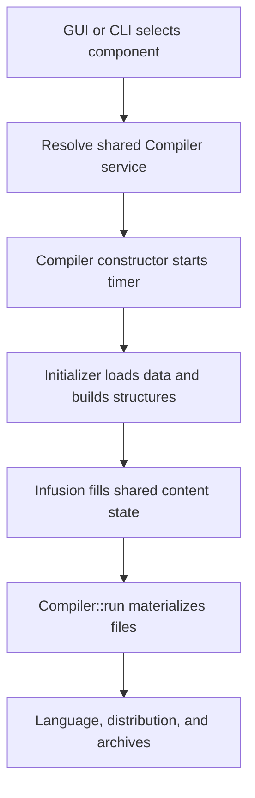
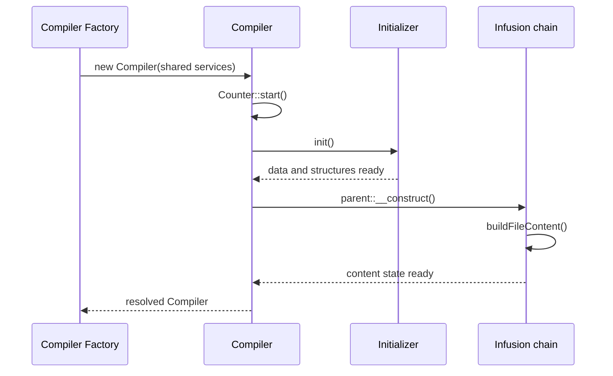
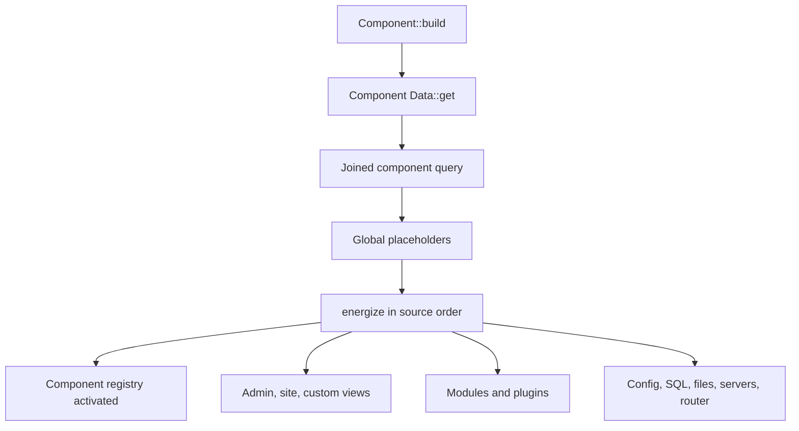
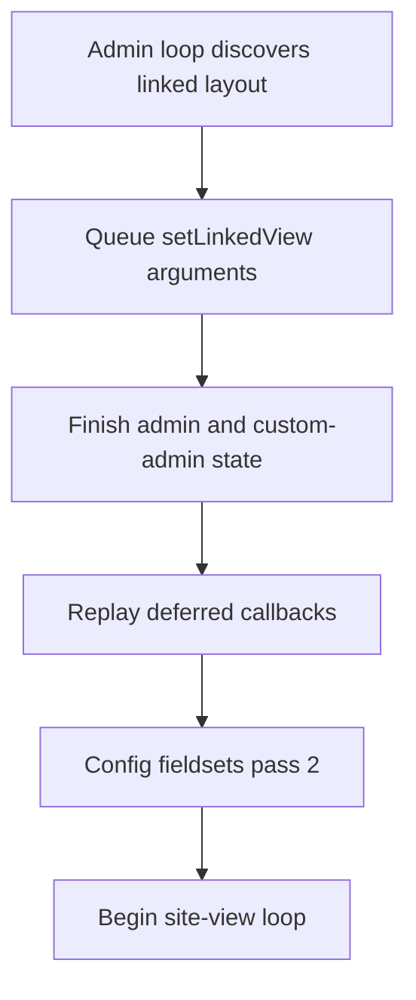
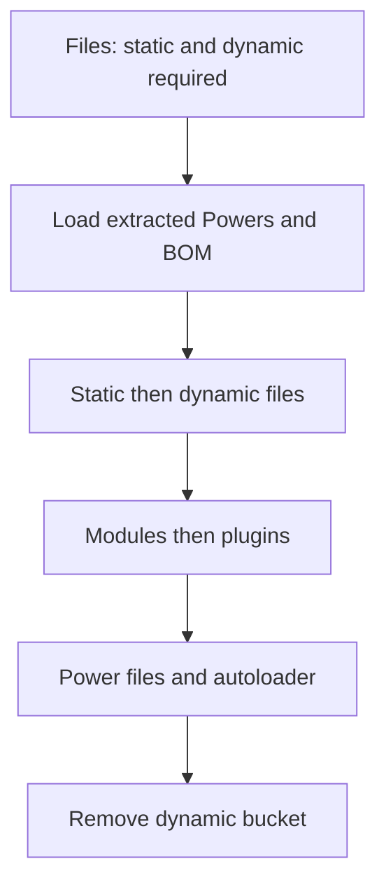

# Compiler execution flow and timing contracts

## Authority and scope

This document records the compiler execution stack as it exists on the `6.x`
branch at commit `8a64568b40757368323f2402d1cd8ef90d37572b`. It follows the runtime from the
administrator and CLI entry points, through service resolution and component
data loading, into legacy Infusion, file materialization, and packaging.

The terms used below are deliberate:

- **Current behavior** is directly evidenced by the linked source.
- **Preservation contract** states behavior whose timing, order, state shape,
  or side effects must remain compatible during refactoring.
- **Change guidance** describes how to extend or extract the implementation. It
  is not a claim that the suggested destination already exists.

This document is about execution, not merely class placement. In this compiler,
resolving an object, reading lazy configuration, loading an entity, invoking an
event, and switching a target can all alter the state consumed later. Moving a
call across one of those boundaries is therefore a behavioral change even when
the call itself is unchanged.

> **Central current contract:** compilation preparation starts when the shared
> `Compiler` service is resolved. `Compiler::run()` does not start component
> loading or Infusion; it finalizes already prepared structures and content.

## End-to-end timeline

There are two externally used paths into the same compiler service:

| Entry | Current call path | Operation boundary |
| --- | --- | --- |
| Administrator | [`CompilerController::compiler()`](../../admin/src/Controller/CompilerController.php#L104-L157) validates the request and permission, calls [`CompilerModel::compile()`](../../admin/src/Model/CompilerModel.php#L289-L298), and that method executes `CompilerFactory::_('Compiler')->run()`. | One component is compiled in the current request. The same container is subsequently read for `Config`, `FilePaths`, `Placeholder`, and `Content.One` when the success response is assembled. |
| CLI | [`Console\Compiler::doExecuteAction()`](../../libraries/vendor_jcb/VDM.Joomla/src/Componentbuilder/Console/Compiler.php#L447-L511) resolves requested components, writes each component ID to Joomla input, executes `JCB::_('Compiler')->run()`, collects paths, and calls `JCB::unset()` after each attempt. | Every component receives a new compiler container. The reset is required because services and builders are shared and mutable for one build. |

## Resolution is an execution boundary

### Container creation

[`Compiler\Factory`](../../libraries/vendor_jcb/VDM.Joomla/src/Componentbuilder/Compiler/Factory.php)
inherits the lazy static-container behavior of
[`Abstraction\Factory`](../../libraries/vendor_jcb/VDM.Joomla/src/Abstraction/Factory.php#L38-L73).
The first `CompilerFactory::_($key)` call creates the container; later calls use
the same container until [`Compiler\Factory::unset()`](../../libraries/vendor_jcb/VDM.Joomla/src/Componentbuilder/Compiler/Factory.php#L101-L110)
is called.

Container creation has these current effects, in order:

1. If needed, it defines `JPATH_COMPONENT_ADMINISTRATOR` for CLI and other
   bootstrap paths.
2. It registers infrastructure, compiler, builder, creator, architecture,
   Power, repository, and Package Get service providers in the order shown in
   [`Factory::createContainer()`](../../libraries/vendor_jcb/VDM.Joomla/src/Componentbuilder/Compiler/Factory.php#L123-L214).
3. A request for `Compiler` invokes the shared factory callback in
   [`Service\Compiler::getJCBCompiler()`](../../libraries/vendor_jcb/VDM.Joomla/src/Componentbuilder/Compiler/Service/Compiler.php#L144-L177).
4. That callback resolves all constructor collaborators and instantiates the
   final [`VDM\Joomla\Componentbuilder\Compiler`](../../libraries/vendor_jcb/VDM.Joomla/src/Componentbuilder/Compiler.php#L65-L347).
5. The final compiler constructor performs the preparation pipeline described
   below before `Container::get('Compiler')` returns to its caller.

The core services `Config`, `Registry`, `FilePaths`, `Initializer`, and
`Compiler` are all registered with `share(..., true)` in
[`Service\Compiler::register()`](../../libraries/vendor_jcb/VDM.Joomla/src/Componentbuilder/Compiler/Service/Compiler.php#L32-L59).
The content builders and the other focused builder registries are likewise
shared; see, for example,
[`BuilderAJ::register()`](../../libraries/vendor_jcb/VDM.Joomla/src/Componentbuilder/Compiler/Service/BuilderAJ.php#L78-L132).

### Consequence

`CompilerFactory::_('Compiler')` is not a harmless dependency-catalog lookup.
It may:

- read request input and component parameters through lazy `Config` getters;
- query and normalize the selected component and all referenced definitions;
- attempt one-time remote retrieval of missing GUID-addressed definitions;
- extract custom code from an installed component;
- delete the previous component build directory;
- create component, library, Power, module, and plugin structures; and
- populate the global and contextual content registries.

**Preservation contract:** diagnostics that enumerate container keys must not
resolve `Compiler` merely to prove that it is constructible. A long-lived
process must select and validate one component/target, use one fresh compiler
container for that build, collect the result, and then call `Factory::unset()`
before starting another build.

## Compiler constructor: exact order

The final compiler extends legacy
[`Helper\Infusion`](../../libraries/vendor_jcb/VDM.Joomla/src/Componentbuilder/Compiler/Helper/Infusion.php),
which extends `Interpretation`, which extends `Fields`. Its constructor order is
explicit in [`Compiler::__construct()`](../../libraries/vendor_jcb/VDM.Joomla/src/Componentbuilder/Compiler.php#L277-L347):

| Order | Call | Current effect |
| ---: | --- | --- |
| 1 | Assign the 21 injected collaborators | Makes the same shared `Initializer`, `Config`, `Component`, builders, data services, utilities, updater, counter, and message state available to finalization. |
| 2 | `startCompilationTimer()` | Calls `Counter::start()` **before** data loading, structure creation, and Infusion. The measured compilation therefore includes constructor-side preparation. |
| 3 | `Initializer::init()` | Performs the one-shot data and structure preparation pipeline. |
| 4 | `parent::__construct()` | Enters the legacy helper chain only after initialization is complete. `Fields::__construct()` obtains the Joomla application; `Interpretation::__construct()` delegates to it; `Infusion::__construct()` then invokes `buildFileContent()`. |

The current source has no `Initializer::build()` method. The component-building
call sometimes described by that shorthand is
[`Initializer::buildComponent()`](../../libraries/vendor_jcb/VDM.Joomla/src/Componentbuilder/Compiler/Initializer.php#L376-L385),
which delegates to
[`Component::build()`](../../libraries/vendor_jcb/VDM.Joomla/src/Componentbuilder/Compiler/Component.php#L59-L93).
The database graph is loaded there; it is not loaded by the `Component`
constructor itself.

**Preservation contract:** do not move the timer start, `Initializer::init()`,
or the legacy parent construction past one another. Infusion assumes component
data, builder state, paths, and file structures produced by Initializer already
exist. `run()` assumes Infusion has already completed.

## Initializer execution

[`Initializer::init()`](../../libraries/vendor_jcb/VDM.Joomla/src/Componentbuilder/Compiler/Initializer.php#L263-L299)
uses an `$init` flag. A second call on the same shared instance returns without
repeating any work. Its exact top-level sequence is:

| Order | Method | Current behavior |
| ---: | --- | --- |
| 1 | `triggerBeforeGet()` | Triggers `jcb_ce_onBeforeGet`. |
| 2 | `initializeLanguageTag()` | Copies `Config::lang_tag` to `ComponentbuilderHelper::$langTag`. |
| 3 | `initializeFieldBuilderType()` | Resolves the field builder; if Tidy is unavailable and type `2` was requested, switches to type `1` and enqueues notices. |
| 4 | `extractCustomCode()` | Runs `Customcode.Extractor::run()` against installed source before the old build directory is removed. |
| 5 | `buildComponent()` | Calls the one-shot `Component::build()` data graph. |
| 6 | `ensureComponentVersion()` | Replaces a version without a dot with `1.0.0`. |
| 7 | `updateComponentVersionIfNeeded()` | When no old version exists and SQL add/update builder flags are set, stores the old version and increments the last version segment. |
| 8 | `resetBuildDirectory()` | Removes `Paths::component_path`. This occurs **after** extraction and data modeling, but **before** any structure build. |
| 9 | `loadUtilityPowers()` | Force-loads seven utility Power GUIDs with `Power::get($guid, 1)`. |
| 10 | `triggerAfterGet()` | Triggers `jcb_ce_onAfterGet`. Despite its name, this event occurs before structure defaults and filesystem structures are built. |
| 11 | `initializeStructureDefaults()` | Initializes the six `EXSTRA_*_FOLDERS` and `EXSTRA_*_FILES` global content keys. |
| 12 | `buildExternalStructures()` | In exact order: library structure, Power structure, module structure, plugin structure, then dashboard setup. |
| 13 | `buildComponentStructure()` | In exact order: base component structure, single-instance structure, and dynamic/multiple structure. A `false` result from any becomes a `RuntimeException`. |

Source: [`Initializer`](../../libraries/vendor_jcb/VDM.Joomla/src/Componentbuilder/Compiler/Initializer.php#L301-L527).

### Component one-shot load

[`Component::build()`](../../libraries/vendor_jcb/VDM.Joomla/src/Componentbuilder/Compiler/Component.php#L59-L93)
is independently guarded by the registry's `initialized` flag:

1. return immediately if the component is already initialized;
2. trigger `jcb_ce_onBeforeGetComponentData`;
3. call `Component\Data::get()`;
4. throw if no component could be loaded;
5. load the returned object into the shared Component registry; and
6. trigger `jcb_ce_onAfterGetComponentData`.

That means consumers resolving the shared `Component` service before compiler
resolution receive the same object that Initializer later activates. They must
not replace it with another registry instance.

### Component data load graph

[`Component\Data::get()`](../../libraries/vendor_jcb/VDM.Joomla/src/Componentbuilder/Compiler/Component/Data.php#L289-L331)
performs this sequence:

1. Build a component query for `Config::component_id`. The query selects the
   component and left-joins admin views, site views, custom admin views,
   updates, MySQL tweaks, custom menus, config, dashboard, files/folders,
   modules, plugins, and router association tables. Before returning the query,
   it triggers `jcb_ce_onBeforeQueryComponentData`.
2. Load one object. A missing object or `system_name` returns `null`.
3. Trigger `jcb_ce_onBeforeModelComponentData` with the component by reference.
4. Replace `Placeholder::active` with the component-level global placeholders.
5. Call `energize($component)` to transform the row and load referenced
   definitions.
6. Trigger `jcb_ce_onAfterModelComponentData` with the fully modeled component
   by reference and return it.

`energize()` is itself an order-sensitive orchestration method. The following
is the complete current call order from
[`Component\Data::energize()`](../../libraries/vendor_jcb/VDM.Joomla/src/Componentbuilder/Compiler/Component/Data.php#L421-L462):

| Order | Method | Principal output or downstream call |
| ---: | --- | --- |
| 1 | `setComponentNames()` | Normalized sales and code names. |
| 2 | `setVersion()` | Version copied into shared Config. |
| 3 | `setImagePath()` | Image fragment removed. |
| 4 | `setGlobalConfig()` | Project website and author Config values. |
| 5 | `setFilesFolders()` | Component files/folders model. |
| 6 | `setUiKit()` | UIkit Config value. |
| 7 | `setWhmcs()` | WHMCS model. |
| 8 | `setFootable()` | Footable switches in Config. |
| 9 | `setCustomMenus()` | JSON normalization and custom menu list. |
| 10 | `setSqlTweaks()` | SQL tweak model; this can set SQL builder flags later used by version handling. |
| 11 | `setViews()` | **Admin views first, then site views, then custom admin views.** |
| 12 | `setConfigData()` | Config fields are normalized through Field services and unique-name builders. |
| 13 | `setContributors()` | Contributor data and Config switch. |
| 14 | `setUpdateServer()` | Update/changelog data. |
| 15 | `setBuildDate()` | Build-date Config override when selected. |
| 16 | `setHistory()` | Component history/update SQL modeling. |
| 17 | `setDispenserConfigs()` | Component JavaScript, CSS, PHP installer/helper, and admin/site event code enters the shared Customcode Dispenser. |
| 18 | `setSql()` | Install/uninstall SQL enters the Dispenser. |
| 19 | `setBom()` | BOM path is selected. |
| 20 | `setReadMe()` | README custom code is decoded and updated. |
| 21 | `setDashboardMethods()` | Dashboard HTML/PHP and target-sensitive code. |
| 22 | `setServers()` | URLs, XML filenames, IDs, and protocols are normalized. |
| 23 | `setIgnoreFolders()` | Repository ignore list, defaulting to `.git`. |
| 24 | `setModules()` | Associated module definitions are loaded through the target module data service. |
| 25 | `setPlugins()` | Associated plugin definitions are loaded through the target plugin data service. |
| 26 | `setRouter()` | Site-router builder state is populated last. |

### View and field expansion

The component row contains associations, not ready-to-render views. The view
models expand them while the current language/build targets are deliberately
mutated:

| Association | Expansion |
| --- | --- |
| Admin views | [`Model\Adminviews::set()`](../../libraries/vendor_jcb/VDM.Joomla/src/Componentbuilder/Compiler/Model/Adminviews.php#L81-L187) sorts by configured order, sets admin targets, records site-edit/import/history/Joomla-fields switches, and calls shared `Adminview.Data::get()` for every view. [`Adminview\Data`](../../libraries/vendor_jcb/VDM.Joomla/src/Componentbuilder/Compiler/Adminview/Data.php#L514-L659) then models custom/local tabs, permissions, fields, history, conditions, relations, linked views, JavaScript, CSS, PHP, buttons, import scripts, Ajax, aliases, SQL, and MySQL settings in that order. |
| Site views | [`Model\Siteviews::set()`](../../libraries/vendor_jcb/VDM.Joomla/src/Componentbuilder/Compiler/Model/Siteviews.php#L59-L105) sets site targets and resolves each view through shared `Customview.Data`. |
| Custom admin views | [`Model\Customadminviews::set()`](../../libraries/vendor_jcb/VDM.Joomla/src/Componentbuilder/Compiler/Model/Customadminviews.php#L59-L105) sets `custom_admin`/admin targets and resolves the `custom_admin_view` table through that same shared data service. |
| Site/custom view details | [`Customview\Data::getData()`](../../libraries/vendor_jcb/VDM.Joomla/src/Componentbuilder/Compiler/Customview/Data.php#L387-L507) establishes safe code/context, models libraries, templates/layouts, loaders, main and custom Dynamic Gets, then PHP, JavaScript, CSS, Ajax, and custom buttons. |
| Fields | [`Field\Data::get()`](../../libraries/vendor_jcb/VDM.Joomla/src/Componentbuilder/Compiler/Field/Data.php#L164-L259) loads and models a field definition once, then applies view-specific field custom code when the cached field is requested in a particular view context. |

**Preservation contract:** the order above is not a list of interchangeable
normalizers. Earlier calls populate Config, Registry, Dispenser, language, and
builder state consumed by later calls. Refactoring may extract a step, but must
keep its position, event boundary, target context, and mutations until a
separate compatibility change is explicitly approved and tested.

## Shared-service and cache behavior

The compiler gets much of its performance and coherence from reuse within one
build. There are several distinct forms of reuse:

| State mechanism | Current behavior | Source |
| --- | --- | --- |
| Static factory container | Lazily created once and reused until `Factory::unset()`. | [`Abstraction\Factory`](../../libraries/vendor_jcb/VDM.Joomla/src/Abstraction/Factory.php#L38-L73) |
| Shared DI services | Compiler core, data loaders, renderers, builders, utilities, and selectors are registered with `share(..., true)`. Consumers therefore collaborate through object identity, not copied state. | [`Service\Compiler`](../../libraries/vendor_jcb/VDM.Joomla/src/Componentbuilder/Compiler/Service/Compiler.php#L32-L59), [`Service\Adminview`](../../libraries/vendor_jcb/VDM.Joomla/src/Componentbuilder/Compiler/Service/Adminview.php), [`Service\Customview`](../../libraries/vendor_jcb/VDM.Joomla/src/Componentbuilder/Compiler/Service/Customview.php), [`Service\Field`](../../libraries/vendor_jcb/VDM.Joomla/src/Componentbuilder/Compiler/Service/Field.php) |
| Lazy Config registry | A Config read first checks cached/explicit values, then a computed getter, component parameters, or request input; resolved values are stored. A later explicit `set()` intentionally overrides that state. | [`FunctionRegistry::get()`](../../libraries/vendor_jcb/VDM.Joomla/src/Abstraction/FunctionRegistry.php#L45-L76), [`ComponentConfig::get()`](../../libraries/vendor_jcb/VDM.Joomla/src/Componentbuilder/Abstraction/ComponentConfig.php#L61-L94) |
| Initializer and Component guards | `Initializer::$init` and `Component::$initialized` prevent repeat initialization/data loading within one container. | [`Initializer::init()`](../../libraries/vendor_jcb/VDM.Joomla/src/Componentbuilder/Compiler/Initializer.php#L269-L299), [`Component::build()`](../../libraries/vendor_jcb/VDM.Joomla/src/Componentbuilder/Compiler/Component.php#L66-L93) |
| Admin view cache | Stores modeled objects by numeric ID and indexes both ID and GUID; missing GUIDs may be fetched remotely once, then retried. | [`Adminview\Data::get()`](../../libraries/vendor_jcb/VDM.Joomla/src/Componentbuilder/Compiler/Adminview/Data.php#L340-L438) |
| Site/custom view cache | Stores by ID plus table and indexes ID/GUID plus table, preventing a site-view key from colliding with a custom-admin-view key. Missing GUIDs have a one-time remote retry per area. | [`Customview\Data::get()`](../../libraries/vendor_jcb/VDM.Joomla/src/Componentbuilder/Compiler/Customview/Data.php#L248-L358) |
| Field cache | Stores the modeled field by ID and indexes ID and GUID. The base field is reused, but the view-aware custom-code update still runs when returned. | [`Field\Data`](../../libraries/vendor_jcb/VDM.Joomla/src/Componentbuilder/Compiler/Field/Data.php#L164-L286) |
| Dynamic Get cache | Bulk-loads missing IDs/GUIDs, indexes both forms, counts each entity once, and performs at most the controlled remote retry path. | [`Dynamicget\Data::get()`](../../libraries/vendor_jcb/VDM.Joomla/src/Componentbuilder/Compiler/Dynamicget/Data.php#L212-L295) |
| Library registry cache | Uses `builder.libraries.<guid>` in shared Compiler Registry and caches successful results **and** `false` failures, preventing repeat work. | [`Library\Data::get()`](../../libraries/vendor_jcb/VDM.Joomla/src/Componentbuilder/Compiler/Library/Data.php#L147-L198) |
| Power state | Per-GUID state prevents repeat and recursive loading while Power relationships are expanded; active definitions remain available to later structure, infusion, and file-update phases. | [`Compiler\Power::get()`](../../libraries/vendor_jcb/VDM.Joomla/src/Componentbuilder/Compiler/Power.php#L195-L303) |
| Joomla Power state | Per-GUID state prevents repeated or re-entrant loading, selects the namespace/type for the compile target, and permits only the controlled one-time missing-definition retrieval path. It does not create a Power dependency or physical-placement graph. | [`Compiler\JoomlaPower::get()`](../../libraries/vendor_jcb/VDM.Joomla/src/Componentbuilder/Compiler/JoomlaPower.php#L175-L263), [`JoomlaPower::handlePowerNotFound()`](../../libraries/vendor_jcb/VDM.Joomla/src/Componentbuilder/Compiler/JoomlaPower.php#L376-L405) |

Repeated `get()` calls are therefore not permission to create fresh loaders or
clone returned state. Equally, cached objects are not universally immutable:
some accessors intentionally apply context-specific work on reuse.

**Preservation contract:** retain the cache key domains (including ID/GUID and
table qualifiers), one-time remote retry guards, negative caches, recursion
guards, and shared service identity. Any new reset must occur at the whole-build
boundary unless every dependent builder and cache is proven safe to reset
independently.

## Infusion: content orchestration before `run()`

[`Infusion::__construct()`](../../libraries/vendor_jcb/VDM.Joomla/src/Componentbuilder/Compiler/Helper/Infusion.php#L44-L57)
calls the parent helper constructors and then immediately calls
[`buildFileContent()`](../../libraries/vendor_jcb/VDM.Joomla/src/Componentbuilder/Compiler/Helper/Infusion.php#L59-L2282).
Its outer guard requires `Component::admin_views` to be an array. If that guard
is false, its content-building body is skipped and the method returns `false`.

The class acts as a conductor: it calls focused creator, architecture, header,
language, dynamic-get, and builder services in a fixed order and deposits their
results in shared state. It does not, at this stage, perform the general pass
that replaces every prepared file's placeholders. That transfer occurs later
in `Extension\Files\Updater::update()`.

### Content stores used by Infusion

| Store | Key shape and role | Later consumer |
| --- | --- | --- |
| [`Builder\ContentOne`](../../libraries/vendor_jcb/VDM.Joomla/src/Componentbuilder/Compiler/Builder/ContentOne.php) | Global placeholder content. It has no path separator and normalizes the placeholder key. Examples include component identity, global headers, scripts, router fragments, installer fragments, README, and final config fieldsets. | Static files and any file without a view context through `FileContent::set()`. |
| [`Builder\ContentMulti`](../../libraries/vendor_jcb/VDM.Joomla/src/Componentbuilder/Compiler/Builder/ContentMulti.php) | Contextual content using `|`: `<view-or-artifact>|<placeholder>`. Examples include edit/list view bodies, models, controllers, layouts, module/plugin contexts, and Power contexts. | Dynamic/module/plugin/Power file updaters pass a context to `FileContent::set()`. |
| [`Compiler\Registry`](../../libraries/vendor_jcb/VDM.Joomla/src/Componentbuilder/Compiler/Registry.php) | Dotted coordination state such as dashboard selection, validation rules, linked views, library results, SQL flags, and file-content update markers. | Initializer, Interpretation/Infusion, creators, file content, and finalization services. |
| `Utilities.Files` | `static`, `dynamic`, per-module/plugin, and per-Power file descriptors created while structures are built. | `Extension\Files\Updater`. |
| Focused `Compiler.Builder.*` registries | Semantic state such as fields, layouts, permissions, languages, database metadata, router data, and counters. | Creator/architecture services during Infusion and file/language phases after it. |

### `buildFileContent()` chronology

The method's current large-scale sequence is:

| Order | Phase | Current behavior |
| ---: | --- | --- |
| 1 | Open | Require admin views and trigger `jcb_ce_onBeforeBuildFilesContent`. |
| 2 | Global identity | Populate component name variants, namespace, company, dates, author, license, versions, target XML version, image type, description, and initial access sections in `Content.One`. |
| 3 | Config fieldsets pass 1 | Temporarily target admin language and call `Compiler.Creator.Config.Fieldsets::set(1)`. |
| 4 | Global code | Load component JS/CSS/helper/event code from the Dispenser, initialize global event/router/help content, and copy global component placeholders into `Content.One`. |
| 5 | Admin-view loop | For each admin view, set admin targets and view placeholders; build edit-view content, list-view content, access/router/category/permission content, and per-view layouts into `Content.Multi`, with before/after events at the edit, list, and whole-view boundaries. |
| 6 | Layout completion | Call `setCustomViewLayouts()` after the admin loop. |
| 7 | Custom-admin-view loop | Switch to `custom_admin`/admin targets; build Dynamic Get methods, bodies, forms, templates, headers, toolbars, and contextual content; run before/after custom-admin events; then complete layouts again. |
| 8 | Component aggregates | Build global headers, view arrays, site-edit permissions, menus, license content, contributors, installer content, version SQL, and dashboard content. |
| 9 | Conditional artifacts | Build import, admin/site Ajax, and validation-rule structures and content when their builder/config switches require them. |
| 10 | Deferred admin replay | Execute queued `secondRunAdmin` callbacks. The precise contract is documented below. |
| 11 | Config fieldsets pass 2 | Temporarily target admin language and call `Compiler.Creator.Config.Fieldsets::set(2)`. |
| 12 | Site-view loop | Switch to the site target; build routes, Dynamic Get methods, bodies, forms, templates, headers, toolbars, and contextual content with before/after site-view events; then complete layouts. If no site views exist, set `remove_site_folder`. |
| 13 | Site/global completion | Add site helper/event content if a site or site-edit area remains; build installer hooks, move-folder code, UIkit helper, flattened final config fieldsets, router methods, README/changelog, and the exported component-field catalog. |
| 14 | Power autoloader descriptors | Call `Power.Autoloader::setFiles()` after all component content has identified required Power references. |
| 15 | Module infusion | Save component target/language/prefix, then call `Joomlamodule.Infusion::set()`. |
| 16 | Plugin infusion | Call `Joomlaplugin.Infusion::set()` after module infusion. |
| 17 | Restore and close | Restore the saved component target/language/prefix, trigger `jcb_ce_onAfterBuildFilesContent`, and return `true`. |

The main loop boundaries and their event contracts are visible in
[`Infusion::buildFileContent()`](../../libraries/vendor_jcb/VDM.Joomla/src/Componentbuilder/Compiler/Helper/Infusion.php#L353-L1274)
(admin),
[`custom admin`](../../libraries/vendor_jcb/VDM.Joomla/src/Componentbuilder/Compiler/Helper/Infusion.php#L1276-L1553),
and [`site`](../../libraries/vendor_jcb/VDM.Joomla/src/Componentbuilder/Compiler/Helper/Infusion.php#L1820-L2097).

### The exact second-run contract

The phrase “second run” in the current source does **not** mean a recursive
second invocation of `Compiler`, `Initializer::init()`, `Component::build()`,
or the whole `Infusion::buildFileContent()` method.

It consists of two deliberately late operations:

1. While the first admin-view loop is building edit layouts,
   [`Interpretation::getEditBodyTabs()`](../../libraries/vendor_jcb/VDM.Joomla/src/Componentbuilder/Compiler/Helper/Interpretation.php#L9107-L9319)
   may discover a linked-view layout whose complete linked view context is only
   useful after the admin views have all been processed. It creates the layout
   identifier immediately and appends an argument array to
   `secondRunAdmin['setLinkedView']`.
2. After the admin/custom-admin aggregate work and validation-rule structures,
   but before config-fieldset pass 2 and before the site-view loop,
   [`Infusion`](../../libraries/vendor_jcb/VDM.Joomla/src/Componentbuilder/Compiler/Helper/Infusion.php#L1795-L1818)
   iterates `secondRunAdmin` as `<method> => <argument arrays>` and invokes each
   `$this->{$method}($array)`. In the current tree, a repository search finds
   only the `setLinkedView` producer.

[`Interpretation::setLinkedView()`](../../libraries/vendor_jcb/VDM.Joomla/src/Componentbuilder/Compiler/Helper/Interpretation.php#L9984-L10163)
then resolves the linked admin view from the already loaded component view set
and fills the linked layout header/table, model retrieval fragment, and scripts
in `Content.Multi`.

Immediately after that callback replay, Infusion calls
`Compiler.Creator.Config.Fieldsets::set(2)`. This is the second **fieldset
assembly pass**; it is separate from the `secondRunAdmin` replay, although both
exist for the same architectural reason: earlier traversal discovers state that
can only be completed reliably later.

**Preservation contract:** retain the queue payload, callback timing, linked
view writes, and fieldset pass-2 position. An extraction may replace dynamic
method dispatch with a typed deferred-work service, but it must not eagerly run
the work at discovery time or rerun the complete compiler pipeline. New code
must not describe this mechanism as a full second compilation pass.

## Module, plugin, and Power timing

These extension domains participate at several distinct moments:

| Moment | Modules/plugins | Powers |
| --- | --- | --- |
| Component data | Associated module/plugin IDs are resolved through the target-version data services near the end of `Component\Data::energize()`. | Fields, custom code, component data, and their dependencies can activate Power/Joomla Power definitions. |
| Initializer structures | Module structure then plugin structure are built before component base/single/multiple structures. | Seven utility Powers are force-loaded; Power structure is built after library structure and before module/plugin structures. |
| Infusion | Module Infusion runs before plugin Infusion, with Config target/language/prefix saved and restored around them. | `Power.Autoloader::setFiles()` records needed autoloader files before module/plugin Infusion. |
| File updater | Module file content is updated before plugin file content. | Extracted Powers are loaded first; the Power file updater later rebuilds structure/infusion as needed and writes active/superpower files. Power and Joomla Power injectors run on final file content before each write. |
| Packaging | The component is archived first; all module archives follow; all plugin archives follow. | Power classes ship inside the extension structures that own them; there is no independent top-level Power ZIP phase. |

This multi-stage participation is intentional. Loading a definition, creating
its target structure, generating its contextual content, replacing file
placeholders, injecting Power references, and archiving the result are separate
operations and must not be collapsed without preserving their dependencies.

## Registry-to-files transfer boundary

The structure builders have already created/copied file trees and populated
`Utilities.Files`; Infusion has filled `Content.One`, `Content.Multi`, Registry,
and focused builders. The transfer of that accumulated state into prepared
extension files occurs only after `Compiler::run()` reaches
[`updateExtensionFiles()`](../../libraries/vendor_jcb/VDM.Joomla/src/Componentbuilder/Compiler.php#L576-L596),
which delegates to
[`Extension\Files\Updater::update()`](../../libraries/vendor_jcb/VDM.Joomla/src/Componentbuilder/Compiler/Extension/Files/Updater.php#L148-L185).

`Updater::update()` has this exact current contract:

1. Require both `Utilities.Files` buckets `static` **and** `dynamic`. If either
   is absent, return `false` without running the update sequence.
2. If `Power.Extractor::get_()` returns extracted Super Powers, load them into
   the compiler Power service.
3. Read the configured BOM content.
4. Update ordinary static files.
5. Update contextual dynamic component files.
6. Update module files.
7. Update plugin files.
8. Update Power files.
9. Call `Power.Autoloader::set()`.
10. Update the static Powerloader/autoloader files that were intentionally
    skipped by the ordinary static pass.
11. Remove the `dynamic` Files bucket.
12. Return `true`.

[`Extension\FileContent::set()`](../../libraries/vendor_jcb/VDM.Joomla/src/Componentbuilder/Compiler/Extension/FileContent.php#L151-L223)
is the per-file convergence point. In current order it triggers the before-set
event, sets the global filename, reads the file, triggers the contents event,
handles BOM/PHP headers, applies `Content.One` when the artifact is not
`code.power`, applies contextual `Content.Multi` when supplied, and applies
custom-code updates when marked and when the artifact is not `code.power`. It
then triggers the before-write event, injects Super Power followed by Joomla
Power references, writes the file, and increments the line counter. The
`code.power` artifact deliberately bypasses global replacement and
`Customcode::update()`, but still participates in contextual replacement,
events, Power injection, writing, and counting.

**Preservation contract:** do not move final file replacement into the data or
Infusion loops. Preserve the Files-bucket gate, updater order, contextual key
lookup, event positions, Power injection order, dynamic-bucket removal, and the
fact that `jcb_ce_onBeforeGetCustomCode` is triggered only after the updater
returns successfully.

## `Compiler::run()` exact finalization order

[`Compiler::run()`](../../libraries/vendor_jcb/VDM.Joomla/src/Componentbuilder/Compiler.php#L349-L428)
is a strict finalization pipeline over the state prepared during service
resolution:

| Order | Call/event | Current behavior and failure boundary |
| ---: | --- | --- |
| 1 | `initializeTempPath()` | Set the working ZIP directory from `Config::tmp_path`. |
| 2 | `initializeBackupPath()` | Resolve global/component backup override and set `dynamicIntegration` when backup is enabled. |
| 3 | `initializeRepoPath()` | Resolve global/component local repository override. |
| 4 | `cleanupSiteFolderIfRequired()` | If both site and site-edit removal flags are true, remove `/site` and remove the site files/languages blocks from the component manifest. |
| 5 | `cleanupApiFolderIfRequired()` | Remove `/api` when `add_api` is `null`. |
| 6 | Event | Trigger `jcb_ce_onBeforeUpdateFiles` with the compiler instance. |
| 7 | `updateExtensionFiles()` | Run the registry-to-files boundary above. If it fails, return `false` immediately. On success it triggers `jcb_ce_onBeforeGetCustomCode`. |
| 8 | `handleCustomCodeInjection()` | Call `Customcode::get()`; only when it returns true, trigger `jcb_ce_onBeforeAddCustomCode` and inject recorded custom code into generated files. |
| 9 | Event | Trigger `jcb_ce_onBeforeSetLangFileData`. |
| 10 | `setLangFileData()` | Assemble admin/adminsys/site/sitesys languages, synchronize/purge component language database values, and write applicable INI files. |
| 11 | `handleLanguageMessages()` | Enqueue inclusion/exclusion translation notices. |
| 12 | `handleAssetsTableMessages()` | Enqueue ACL rules/name-column notices. |
| 13 | `setXmlServers()` | Process component update/changelog XML first, then module update XML, then plugin update XML. |
| 14 | `buildReadMe()` | Ensure final counters, update up to README.md and README.txt, then remove the static Files bucket. |
| 15 | `setLocalRepos()` | When configured, copy component, then modules, then plugins to local repository paths with before/after events. |
| 16 | `zipComponent()` | Create the component archive, optional backup/server copies, record its path, and remove the component build folder. If ZIP creation or final folder removal fails, return `false` immediately. |
| 17 | `zipModules()` | Archive eligible modules in data order. Individual failures do not become a top-level `false`. |
| 18 | `zipPlugins()` | Archive eligible plugins in data order. Individual failures do not become a top-level `false`. |
| 19 | `handleLanguageMismatchWarnings()` | Compare extracted language match/mismatch sets and enqueue warnings. |
| 20 | `handleExternalCodeNotices()` | Enqueue the external-code notice when recorded strings exist. |
| 21 | `endCompilationTimer()` | Call `Counter::end()`. |
| 22 | Return | Return `true`. |

### Early returns and exceptions

There are exactly two explicit `false` gates in the top-level `run()` method:

- `Extension\Files\Updater::update()` failure; and
- component ZIP/final component-directory removal failure.

Both return before `endCompilationTimer()`. That is current observable behavior,
also recorded in [architecture review findings](review-findings.md#operation-and-status-lifecycle).
`run()` does not wrap the pipeline in a catch/finally block, so exceptions also
propagate without reaching the nominal timer end. Module/plugin ZIP failures,
repository copy failures, and server transfer failures are handled or reported
inside their phases and do not add another top-level boolean gate.

**Preservation contract:** adding `finally`, changing the boolean gates, or
promoting best-effort module/plugin/remote failures to a compiler failure may
be desirable in a separately approved change, but it is not a behavior-neutral
refactor.

## Distribution and archive event order

The top-level outline hides by-reference extension points that must also remain
in position:

| Phase | Current nested sequence |
| --- | --- |
| Local repository sync | For component, then each module, then each plugin: `jcb_ce_onBeforeUpdateRepo` → remove/copy repository tree → `jcb_ce_onAfterUpdateRepo`. Event arguments include mutable contexts, source paths, destination paths, and module/plugin objects. |
| Component archive | Set file paths → `jcb_ce_onBeforeZipComponent` → ZIP → optional `jcb_ce_onBeforeBackupZip` and backup copy → optional `jcb_ce_onBeforeMoveToServer` and server transfer → `jcb_ce_onAfterZipComponent` → record possibly mutated ZIP path → remove component folder. |
| Module archive | For each eligible module: set paths → `jcb_ce_onBeforeZipModule` → ZIP → optional backup event/copy → optional move event/server transfer → `jcb_ce_onAfterZipModule` → record path → remove module folder. |
| Plugin archive | Same shape as modules, after the complete module loop, using plugin contexts and plugin events. |

Source: [`Compiler::setLocalRepos()`](../../libraries/vendor_jcb/VDM.Joomla/src/Componentbuilder/Compiler.php#L1226-L1372),
[`zipComponent()`](../../libraries/vendor_jcb/VDM.Joomla/src/Componentbuilder/Compiler.php#L1374-L1480),
[`zipModules()`](../../libraries/vendor_jcb/VDM.Joomla/src/Componentbuilder/Compiler.php#L1482-L1610),
and [`zipPlugins()`](../../libraries/vendor_jcb/VDM.Joomla/src/Componentbuilder/Compiler.php#L1612-L1740).

Event arguments are frequently passed by reference so plugins can alter paths,
contexts, names, and objects. Preserving an event name while moving it after a
side effect, passing a copy, or narrowing its arguments would still break the
event contract.

## Non-negotiable timing and refactoring contracts

Unless an explicitly approved behavior change is accompanied by compatibility
tests and migration documentation, compiler work must preserve all of the
following:

1. **Resolution boundary:** obtaining the shared `Compiler` service performs
   timer start, initialization, structure construction, and Infusion before it
   returns.
2. **Constructor order:** timer → `Initializer::init()` → legacy
   `Infusion::__construct()`/`buildFileContent()` → later explicit `run()`.
3. **Initializer order:** extract before deleting old build output; load and
   model component before structures; emit `jcb_ce_onAfterGet` before structure
   construction; external structures before component structures.
4. **Component data order:** preserve the joined query and model event window,
   placeholder activation, complete `energize()` order, and admin → site →
   custom-admin view loading order.
5. **Shared build identity:** do not substitute fresh Config, Component,
   Registry, builder, data-loader, Files, Counter, Power, module, or plugin
   objects for their shared container instances.
6. **One build per container:** reset the compiler factory between components
   in any loop, worker, API, MCP, or test process.
7. **Cache semantics:** preserve ID/GUID/table indexes, negative results,
   recursion guards, one-time remote retries, and view-aware work performed on
   cached entities.
8. **Target context:** preserve every `build_target`, `lang_target`, and
   `lang_prefix` switch and restore, especially around view loops and
   module/plugin Infusion.
9. **Registry contracts:** preserve `Content.One` and
   `<context>|<placeholder>` `Content.Multi` keys, dotted Registry paths,
   focused builder path shapes, value types, and `set` versus `add` behavior.
10. **Infusion order:** global state → admin loop → custom-admin loop →
    aggregates/deferred work → fieldset pass 2 → site loop → final component
    state → Power autoloader descriptors → module Infusion → plugin Infusion.
11. **Deferred-work semantics:** `secondRunAdmin` is a late callback replay,
    currently for `setLinkedView`; config fieldsets also have explicit passes 1
    and 2. Neither is a second recursive compiler execution.
12. **Materialization boundary:** require both Files buckets and retain updater
    order: extracted Powers/BOM → static → dynamic → modules → plugins → Powers
    → autoloader → static autoloader → remove dynamic.
13. **Per-file convergence:** retain global replacement when applicable,
    contextual replacement, custom-code update conditions, events, Super
    Power/Joomla Power injection, write, and line counting in their current
    order. Preserve the `code.power` bypass of global and custom-code updates.
14. **Finalization order:** cleanup before file update; file update before
    custom-code injection; language after custom code; XML/README/repositories
    before archives; component archive before module/plugin archives; notices
    and timer end last.
15. **Events:** preserve names, exact relative positions, argument order,
    by-reference semantics, and mutation visibility.
16. **Failure behavior:** preserve the two top-level `false` gates, best-effort
    nested phases, exception propagation, directory cleanup conditions, and
    present timer behavior unless deliberately changed.
17. **Generated-code compatibility:** preserve Power and Joomla Power loading,
    namespace/placeholder resolution, target-version selection, and generated
    output. Refactoring success is measured by equivalent artifacts and event
    traces, not merely equivalent method names.

## Safe extraction rule

The remaining `Fields` → `Interpretation` → `Infusion` inheritance chain is a
legacy compatibility seam. A safe extraction should:

1. characterize the current call's inputs, target context, registry reads and
   writes, events, Files mutations, and generated output;
2. create a focused injected service at the same execution position;
3. keep the existing method as a temporary delegating compatibility shim when
   dynamic callbacks or callers require it;
4. reuse the shared builders and entity loaders rather than copying their
   state;
5. compare event traces and generated trees/archives against a fixture; and
6. remove the shim only after callers and the deferred dispatch surface have
   been proven absent.

No extraction is complete if it changes when data becomes knowable. The
compiler's principal architectural contract is not only **what** each service
produces, but **when** that result enters shared state and which later phase is
allowed to consume it.
