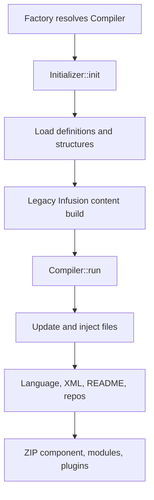

# Compiler architecture

This document explains the compiler's composition, state, version dispatch,
interfaces, and placement rules. Read the
[compiler execution flow](compiler-execution-flow.md) alongside it for the
source-ordered constructor-to-archive chronology and the timing contracts that
must remain exact during refactoring.

## Boundary and entry points

The compiler lives primarily under
[`VDM.Joomla/src/Componentbuilder/Compiler`](../../libraries/vendor_jcb/VDM.Joomla/src/Componentbuilder/Compiler).
Its composition root is
[`Compiler\Factory`](../../libraries/vendor_jcb/VDM.Joomla/src/Componentbuilder/Compiler/Factory.php).

The administrator compile action delegates to the shared compiler service from
[`CompilerModel::compile()`](../../admin/src/Model/CompilerModel.php). The CLI
command in
[`Componentbuilder\Console\Compiler`](../../libraries/vendor_jcb/VDM.Joomla/src/Componentbuilder/Console/Compiler.php)
sets the component and target-version input, resolves the same compiler, calls
`run()`, collects `FilePaths`, and resets the compiler factory between separate
component builds.

That reset is meaningful: shared services hold mutable state for one
compilation. A factory container must not leak from one component build into
the next.

## Composition root

`Compiler\Factory::createContainer()` registers the compiler's full object
graph. Provider families include:

| Family | Responsibility |
| --- | --- |
| Core infrastructure | cryptography, servers, APIs, network, database, base models, and data services |
| Compiler core | Config, Registry, Table, FilePaths, Initializer, and final Compiler |
| Cross-cutting generation | event, header, history, language, placeholder, and custom code |
| Domain loading | component, admin view, custom view, template/layout, library, field, module, and plugin |
| Shared build state | `BuilderAJ` and `BuilderLZ` registry services |
| Rendering | creator services and architecture services for component/model/view/controller/dashboard/module/plugin |
| Reusable code | Power and JoomlaPower services |
| Remote access | Git, Github, Gitea, API, and network services |
| Definition retrieval | Package Get providers for compiler dependencies |

`BuilderAJ` and `BuilderLZ` are an alphabetical split used to keep two very
large provider files manageable. They do not denote different lifecycle or
architectural layers.

All 509 registrations in the 31 compiler-local providers are shared within the
container. A static dependency scan found no cycle among 1,727 literal
compiler-owned resolution edges; dynamic version keys and external provider
internals are outside that textual result.

## Construction and execution lifecycle

The core provider registers `Config`, `Registry`, `Table`, `FilePaths`,
`Initializer`, and the final compiler as shared services. The final compiler
receives 21 typed collaborators. Its constructor:

1. stores injected services;
2. starts compilation timing;
3. invokes `Initializer::init()`; and
4. invokes the legacy `Infusion` constructor, which builds file content.

The legacy call is an explicit transition seam. New code should be extracted
outward from it, not added to the inheritance chain.

The constructor boundary is architectural: component data loading, structure
preparation, and legacy content infusion happen while the shared `Compiler`
service is being resolved. `run()` is the subsequent materialization and
packaging phase; it is not the beginning of all compilation work.

Resolving the `Compiler` key is therefore side-effectful: initialization may
query data, retrieve missing definitions, clear/rebuild directories, and fill
shared content before `run()` is called. Container diagnostics must not resolve
this key merely to prove that every registration can instantiate.



### Initializer phase

[`Initializer::init()`](../../libraries/vendor_jcb/VDM.Joomla/src/Componentbuilder/Compiler/Initializer.php)
is guarded to run once. In source order it:

1. triggers `jcb_ce_onBeforeGet`;
2. initializes language and field-builder configuration;
3. extracts installed custom code;
4. builds the component data model;
5. normalizes and, where required, updates the component version;
6. resets the build directory;
7. loads required utility powers;
8. triggers the post-load event; and
9. initializes external, library, power, module, plugin, dashboard, and
   component structures.

### Infusion phase

[`Helper\Infusion`](../../libraries/vendor_jcb/VDM.Joomla/src/Componentbuilder/Compiler/Helper/Infusion.php)
currently fills global and per-view content registries, coordinates creator and
architecture services, switches build/language targets, and emits the content
used to populate the prepared structures. This is still a large legacy
orchestrator and is a primary extraction target.

### Finalization phase

[`Componentbuilder\Compiler::run()`](../../libraries/vendor_jcb/VDM.Joomla/src/Componentbuilder/Compiler.php)
preserves a strict side-effect order:

1. resolve temporary, backup, and local-repository paths;
2. remove site/API folders when configuration requires it;
3. trigger `jcb_ce_onBeforeUpdateFiles`;
4. update generated extension files and, on success, trigger
   `jcb_ce_onBeforeGetCustomCode`;
5. retrieve custom code and, when present, trigger
   `jcb_ce_onBeforeAddCustomCode` before injection and validation;
6. trigger `jcb_ce_onBeforeSetLangFileData` and write language data;
7. emit language and assets-table notices;
8. publish XML server files and build README files;
9. synchronize local repositories;
10. archive the component, modules, and plugins;
11. emit mismatch/external-code notices; and
12. stop compilation timing.

Order, event names, arguments, early returns, messages, file mutations, and
archive names are current behavioral contracts.

The numbered list is a phase outline, not a complete event catalog. Repository
sync and component, module, and plugin archive, backup, and server-move paths
emit additional before/after events, many with by-reference arguments:

| Nested phase | Current events |
| --- | --- |
| File/custom-code update | `jcb_ce_onBeforeGetCustomCode`, and when custom code exists, `jcb_ce_onBeforeAddCustomCode` |
| Local repository update | `jcb_ce_onBeforeUpdateRepo` / `jcb_ce_onAfterUpdateRepo` for component, module, and plugin contexts, with by-reference paths/objects |
| Component archive | before/after component ZIP, optional backup ZIP, and optional server move events |
| Module archive | before/after module ZIP plus optional backup/server events per module |
| Plugin archive | before/after plugin ZIP plus optional backup/server events per plugin |

`run()` returns `false` when extension-file update fails or when
`zipComponent()` fails, whether because ZIP creation failed or because the
final component-directory removal failed. Module/plugin archive methods report
within their own loops rather than forming additional top-level boolean gates.
Refactoring must preserve those failure boundaries as well as the events.

## Shared state: builders, not one global array

The 108 classes directly under
[`Compiler/Builder`](../../libraries/vendor_jcb/VDM.Joomla/src/Componentbuilder/Compiler/Builder)
all extend the VDM registry abstraction. Most are deliberately small: each
replaces one historical array with a named, shared object. This yields:

- identity: every consumer receives the same instance in one build;
- isolation: unrelated state does not share a single key space;
- explicit dependencies: constructors show which state a service reads or
  writes;
- behavior: a registry can add domain-specific normalization and convenience
  methods; and
- resetability: discarding the factory discards the build graph.

Two content registries illustrate specialized key behavior:

- [`ContentOne`](../../libraries/vendor_jcb/VDM.Joomla/src/Componentbuilder/Compiler/Builder/ContentOne.php)
  flattens keys and normalizes placeholder names.
- [`ContentMulti`](../../libraries/vendor_jcb/VDM.Joomla/src/Componentbuilder/Compiler/Builder/ContentMulti.php)
  uses `|` to separate an objective (for example a view) from a normalized
  placeholder key.

Do not conflate these builder registries with
[`Compiler\Registry`](../../libraries/vendor_jcb/VDM.Joomla/src/Componentbuilder/Compiler/Registry.php),
which extends the Joomla-Registry-based `Componentbuilder\Abstraction\BaseRegistry`.
They have different ancestry and purposes even though both store scoped state.

### Builder rule

When extracted behavior needs data produced now and consumed later:

1. identify the semantic dataset, not merely its current array variable;
2. reuse its existing builder if the path contract already exists;
3. otherwise create one focused builder class;
4. register it as a shared `Compiler.Builder.*` service;
5. inject that builder into producers and consumers; and
6. preserve path separators, path shapes, add/set semantics, and value types.

## The two Joomla-version axes

The compiler must answer two different questions.

| Axis | Question | Source | Representative services |
| --- | --- | --- | --- |
| Host/runtime | “Which Joomla major is running JCB?” | `Joomla\CMS\Version::MAJOR_VERSION` | Event dispatch, history integration, core-field and core-rule introspection |
| Compile target | “Which Joomla major are we generating?” | `Config->joomla_version`, normally posted input with host major as default | Header generation, architecture output, settings, install scripts, input buttons, module/plugin generation |

[`Service\Field`](../../libraries/vendor_jcb/VDM.Joomla/src/Componentbuilder/Compiler/Service/Field.php)
demonstrates why the distinction matters: its core-field service follows the
host version because it inspects the installed CMS, while its generated input
button follows the compile target.

The complete explicit version matrix at the documented baseline contains 40
generic dispatch families and 160 concrete implementations. Four families are
host-selected (`Event`, `History`, `Field.Core.Field`, and `Field.Core.Rule`);
36 generate target-specific output. `Field.Core.Rule` is registered by the
broad [`Componentbuilder\Service\CoreRules`](../../libraries/vendor_jcb/VDM.Joomla/src/Componentbuilder/Service/CoreRules.php)
provider rather than a provider under `Compiler/Service`, which is why a scan
limited to the compiler provider folder will miss it.

Config's supported catalogue maps targets as follows:

| Target | Template `folder_key` | Manifest XML version |
| --- | ---: | ---: |
| Joomla 3 | 3 | 3.10 |
| Joomla 4 | 4 | 4.0 |
| Joomla 5 | 4 | 5.0 |
| Joomla 6 | 4 | 6.0 |

Joomla 4–6 currently reuse the same broad template-folder family while keeping
separate concrete PHP services. Target input is read as an integer; external
entry points should validate it against the supported catalogue before a
dynamic service key is constructed.

### Selector pattern

A version-aware provider registers every concrete implementation and exposes a
stable logical alias. The logical factory callback reads the correct axis once
and returns the matching concrete service. Conceptually:

```php
$container->alias(AddToolBarInterface::class, 'Architecture.AdminView.AddToolBar')
    ->share('Architecture.AdminView.AddToolBar', [$this, 'getAddToolBar'], true);

// Concrete services are also shared:
// Architecture.AdminView.J3.AddToolBar
// Architecture.AdminView.J4.AddToolBar
// Architecture.AdminView.J5.AddToolBar
// Architecture.AdminView.J6.AddToolBar

return $container->get(
    'Architecture.AdminView.J'
    . $container->get('Config')->joomla_version
    . '.AddToolBar'
);
```

Callers depend on the stable alias/interface and contain no `if Joomla 3 … else
Joomla 4 …` branch. The provider owns selection; the concrete class owns the
variant.

The `J3` token does not occupy one universal position in service keys. Examples
include `J3.Header`, `Model.J3.Customtabs`, `Component.J3.Settings`,
`J3.Extension.InstallScript`, `Joomlamodule.J3.Data`, and
`Architecture.AdminView.J3.AddToolBar`. Inspection tools should derive keys
from the owning provider rather than assume a global string pattern.

### Version placement depth

Version classes live at the shallowest domain that accurately describes their
use:

| Location | Why it lives there | Examples per Joomla major |
| --- | --- | --- |
| `Compiler/Joomla*` | Broad compiler-wide integration or output | Event, Header, History |
| `Compiler/Architecture/Joomla*/<objective>` | Generated Joomla application architecture | admin view toolbars, controllers, models, module/plugin provider code |
| `Compiler/Component/Joomla*` | Component data/settings concern | Settings |
| `Compiler/Extension/Joomla*` | Extension installation/update concern | InstallScript, MoveFieldsRules |
| `Compiler/Field/Joomla*` | Field generation or host field introspection | CoreField, CoreRule, InputButton |
| `Compiler/Joomlamodule/Joomla*` | Whole module pipeline | Data, Structure, Infusion |
| `Compiler/Joomlaplugin/Joomla*` | Whole plugin pipeline | Data, Structure, Infusion |
| `Compiler/Model/Joomla*` | Compiler-side model transformation | Customtabs |

Not every class needs four copies. Logic shared without a meaningful Joomla
variation should remain in a common domain class. A variant can also be thin
and delegate shared mechanics to an injected common collaborator.

`Architecture/Model/AllowEdit` is the clearest current example: Joomla 4–6
wrappers extend a common implementation while retaining distinct services and
version identity; Joomla 3 keeps its different implementation. High textual
parity between versions is not by itself permission to collapse services—the
separation preserves independent evolution and keeps version branching out of
callers.

### Architecture target families

The 29 target-selected Architecture families are:

| Objective | Stable families |
| --- | --- |
| Component helper | `Architecture.ComHelperClass.CreateUser`, `Architecture.ComHelperClass.ExcelMethods` |
| View menus | `Architecture.Menu.CustomView` |
| Model | `AllowEdit`, `CanDelete`, `CanEditState`, `CheckInNow` |
| Admin single/list view | single `AddToolBar`, single `AddModalToolBar`, plural `AddToolBar`, plural `DisplayMethod`, plural `ListHead` |
| Site/custom views | site `AddToolBar`, custom single `AddToolBar`, custom plural `AddToolBar`, `CustomView.DisplayMethod` |
| Controller | `AllowAdd`, `AllowEdit`, `AllowEditViews` |
| Dashboard | `Architecture.Dashboard.View` |
| Module | `Library`, `Template`, `Helper`, `Dispatcher`, `Provider`, `MainXML` |
| Plugin | `Extension`, `Provider`, `MainXML` |

Each family has J3/J4/J5/J6 concrete services. Singular and plural
CustomAdminView toolbar services share one custom-admin interface, so 29
families correspond to 28 effective Architecture contracts. The
`ExcelMethods` and `Menu.CustomView` families extracted from the legacy
helper keep their shared mechanics outside the version folders and use
thin target variants for the user-lookup and fieldset-path differences.
The unversioned `Architecture.Menu.AdminView` service builds the admin
view site menu beside that family.

## Interfaces and aliases are the stable seam

Most versioned implementations implement contracts under
[`Compiler/Interfaces`](../../libraries/vendor_jcb/VDM.Joomla/src/Componentbuilder/Compiler/Interfaces).
The module and plugin `MainXMLInterface` contracts intentionally live one level
higher under
[`Componentbuilder/Interfaces/Architecture`](../../libraries/vendor_jcb/VDM.Joomla/src/Componentbuilder/Interfaces/Architecture)
for broader reuse. Service aliases provide stable container names. Typed
constructor injection is preferred in extracted classes; string aliases remain
useful at composition boundaries and for compatibility with the legacy helper.

When adding a target-specific implementation:

1. locate or introduce the narrow shared interface;
2. keep shared mechanics outside version folders;
3. retain distinct J3/J4/J5/J6 target classes and service identities for every
   dispatched family, using thin wrappers or delegates when output is
   currently identical;
4. register all concrete services with consistent `J3`/`J4`/`J5`/`J6` keys;
5. make the stable alias select from `Config->joomla_version`;
6. inject the stable interface into consumers; and
7. test all supported targets, including the target/host distinction.

## Factories versus injection

The factory is required to bootstrap the graph and is still heavily used by
the deprecated helper chain. It is not the preferred dependency mechanism for
new classes.

New or extracted code should:

- declare typed constructor dependencies;
- be created in the closest service provider;
- receive shared builders from the container;
- use an interface when multiple implementations are selected; and
- leave a narrow delegation call in the legacy helper until callers migrate.

Adding `CFactory::_('…')` inside a newly extracted class hides its graph and
recreates the service-locator design being removed.

Generic version aliases are shared too. Once a logical alias has selected a
concrete implementation, mutating `Config->joomla_version` does not replace the
cached service. One factory container must represent one compile target; the
CLI correctly calls `Factory::unset()` between independent component builds.

## Placement decision record

Before moving a method cluster, answer these questions in the change or PR:

1. What generated artifact or compiler phase owns the behavior?
2. Which methods form its complete internal call cluster?
3. Which service aliases and builder paths does it read and write?
4. Does it use host Joomla behavior, target Joomla output, or neither?
5. What event, message, ordering, and mutation contracts must remain exact?
6. Is its logic common, version-specific, or a common core with thin variants?
7. Which existing provider is the closest composition boundary?

Those answers, rather than a generic design-pattern preference, determine the
namespace and class shape.
