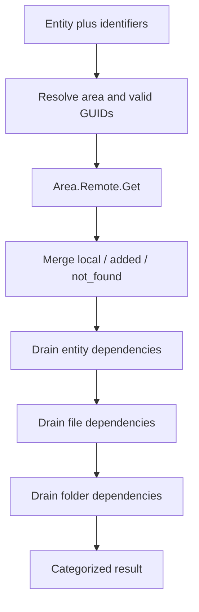
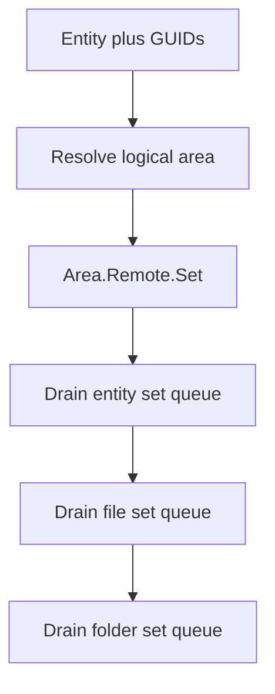

# Package distribution engine

## Purpose and boundary

[`Componentbuilder/Package`](../../libraries/vendor_jcb/VDM.Joomla/src/Componentbuilder/Package)
is JCB's definition distribution and synchronization engine. It moves
database-backed JCB entities and their dependent documents, files, and folders
between a Joomla installation and configured Git repositories.

It does **not** compile those definitions into a Joomla extension. A useful
distinction is:

- **Package** serializes, retrieves, resolves, and persists the source
  definitions from which JCB can build.
- **Compiler** transforms the loaded definitions into generated source trees
  and installation archives.

The compiler imports Package Get capabilities because a compilation may need
to retrieve missing definitions. This intentional reuse does not merge the two
bounded contexts.

## Composition

[`Package\Factory`](../../libraries/vendor_jcb/VDM.Joomla/src/Componentbuilder/Package/Factory.php)
creates a standalone container with both Get and Set providers for components,
modules, plugins, views, custom code, dynamic gets, templates, layouts,
libraries, fields, and dependencies. It also registers database/model/data,
Power, Git/Github/Gitea, API, network, and utility providers.

[`Compiler\Service\Package`](../../libraries/vendor_jcb/VDM.Joomla/src/Componentbuilder/Compiler/Service/Package.php)
registers only the shared dependency tracker, message bus, and Package Get
orchestrator. The compiler factory then registers the entity-specific Get
providers. It deliberately does not expose the full Set graph.

| Container | Get entities | Set entities | Shared tracker/messages | Intended use |
| --- | --- | --- | --- | --- |
| Package factory | Yes | Yes | Yes | Standalone pull/push and distribution workflows |
| Compiler factory | Yes | No | Yes | Resolve definitions needed during a compile |

## Entity routing

The builders receive a canonical database entity such as `admin_view`,
`joomla_component`, `joomla_module`, or `field`. They ask the central
[`Componentbuilder\Factory`](../../libraries/vendor_jcb/VDM.Joomla/src/Componentbuilder/Factory.php)
for its logical area. That area becomes a service prefix:

```text
admin_view  -> AdminView  -> AdminView.Remote.Get / AdminView.Remote.Set
field       -> Field      -> Field.Remote.Get / Field.Remote.Set
power       -> Power      -> the Power-specific factory and services
```

The authoritative entity map must be updated before a new distributable entity
can participate predictably. Ad-hoc switches in the Get or Set builders would
duplicate that source of truth.

At the documented baseline the central map contains 45 entities: 40 route to
the Package factory and five (`fieldtype`, `power`, `joomla_power`, `repository`,
and `snippet`) route to their specialized factories. The 40 Package entities
span:

| Family | Entities |
| --- | --- |
| Component | `joomla_component` plus its admin/custom/site views, router, config, placeholders, updates, files/folders, menus, dashboard, modules, and plugins link entities |
| Module | `joomla_module`, updates, and files/folders/URLs |
| Plugin | `joomla_plugin`, group, updates, and files/folders/URLs |
| Views | `admin_view`, admin fields/relations/conditions/tabs, `custom_admin_view`, and `site_view` |
| Reusable definitions | template, layout, dynamic get, custom code, field, validation rule, library and library children |
| Dependencies | class method, class property, class extends, and placeholder |

File and Folder are two additional Package pseudo-entities. They have remote
configuration and services but are intentionally dispatched through dedicated
asset queues rather than the central database-entity map. The tree therefore
contains 42 remote configuration classes: 40 mapped entities plus File and
Folder.

## Get flow

[`Package\Builder\Get`](../../libraries/vendor_jcb/VDM.Joomla/src/Componentbuilder/Package/Builder/Get.php)
is a capability-tolerant orchestrator. It treats missing handlers as no-ops
after `Container::has()` checks, so a smaller container may support only a
subset of areas. Exceptions raised by registered Grep or Remote handlers are
not caught by the builder.



The public pathways serve slightly different callers:

- `get(entity, items)` resolves aliases/identifiers through the area's Grep
  service, invokes its remote Get handler, and recursively drains dependencies.
- `init(entity, items, repo, force)` accepts an explicit repository and force
  option.
- `reset(entity, items)` resets the selected entities and recursively follows
  inbound (`direction: in`) dependency edges; outbound/parent edges are
  excluded. It then delegates asset resets when those capabilities exist.
- `validRepo()` and `getValidGuids()` delegate entity-specific validation to
  the Grep service.

Results accumulate in three categories: `local`, `added`, and `not_found`.
Merging uses array union (`+=`), so an existing key in a category wins. The
three buckets are independent and persist across calls. Callers, including the
CLI Get command, should use those categories rather than inferring success
from a single boolean.

## Set flow

[`Package\Builder\Set`](../../libraries/vendor_jcb/VDM.Joomla/src/Componentbuilder/Package/Builder/Set.php)
maps the entity to `<Area>.Remote.Set`, saves the requested GUIDs, and drains
deferred dependencies discovered during serialization.



The Set builder is also capability-driven: missing entity, file, or folder
handlers are skipped. The caller-facing CLI Push command invokes
`Package.Builder.Set::items()` synchronously and obtains diagnostic messages
through the message bus.

## Dependency tracker and message bus

[`Package\Service\Power`](../../libraries/vendor_jcb/VDM.Joomla/src/Componentbuilder/Package/Service/Power.php)
registers these shared services:

| Alias | Class | Role |
| --- | --- | --- |
| `Power.Table` | `Componentbuilder\Power\Table` | Entity/table metadata used by package handlers |
| `Package.Tracker` | `Package\Dependency\Tracker` | Deferred entity, file, and folder work queues |
| `Package.Message` | `Package\MessageBus` | Operation diagnostics for UI/CLI consumers |
| `Package.Builder.Get` | `Package\Builder\Get` | Pull orchestration |
| `Package.Builder.Set` | `Package\Builder\Set` | Push orchestration |

Remote handlers discover dependencies while processing one entity and add
them to tracker paths such as `get`, `set`, `file.get`, `folder.get`,
`file.set`, and `folder.set`. The outer builder removes each queue before
processing it, allowing newly discovered work to be collected and drained in
another loop.

Queue path names, value shapes, removal timing, and recursive order are
behavioral contracts. Changing them requires coordinated updates across all
entity handlers.

## Per-entity service pattern

Most top-level entity folders repeat a deliberate composition pattern.

### Get side

- repository configuration and path rules;
- a Grep/resolver that validates repositories and identifiers;
- an entity-specific Remote Get service;
- generic Git repository-contents access;
- data item persistence;
- shared tracker and message bus; and
- dependencies that can enqueue related entities or assets.

### Set side

- a resolver/normalizer for the local entity document;
- an entity-specific Remote Set service;
- a README renderer where the area owns repository documentation;
- data item/load helpers;
- shared tracker and Grep services; and
- approved repository paths and Git contents access.

This repetition is a stable extension template, not accidental duplication.
Common mechanics belong in shared Package abstractions; entity schema and path
knowledge remain in the entity folder.

### Declarative remote configuration

[`Abstraction\Remote\Config`](../../libraries/vendor_jcb/VDM.Joomla/src/Abstraction/Remote/Config.php)
defines the common configuration surface: table and area, GUID/helper fields,
ignored fields, index/source/settings paths, README paths, placeholders,
serialization maps, children, and file/folder mappings. Deep entity Config
classes supply those values.

That is how the same remote algorithms can handle very different shapes. A
component config declares twelve direct child areas and component assets;
CustomCode uses `function_name` and custom-code placeholders; ClassMethod is
independently indexed but disables README output. Keep entity knowledge in
these declarative leaf classes instead of branching the shared Get/Set
algorithm.

## Repository selection and transport

Package Config supplies the default package repository set and merges
configured repository records. The records describe provider type, domain,
organization, repository, read/write branches, credentials, author details,
and placeholders. Network Resolve can redirect an unavailable repository to a
healthy mirror before Grep reads it.

`Git.Repository.Contents` is a provider-neutral facade over the Github and
Gitea contents implementations. Entity handlers should depend on that facade,
not branch on provider type. Repository credentials are operation secrets and
must be redacted from logs, API payloads, MCP responses, and diagnostics.

## Related but separate bounded contexts

Repository, Power, JoomlaPower, Fieldtype, and Snippet use their own factory
containers and often register Package's tracker/message/builders inside those
containers. Identical service aliases in two factories do not identify the
same object. Resolve an entity handler and its Package state from the same
factory.

Spreadsheet import/export is also separate. `Componentbuilder/Import` maps
spreadsheet rows into database entities; `Spreadsheet.Exporter` emits tabular
data. Package Pull/Push performs JSON/repository graph distribution. API names
should preserve those distinctions.

## State-lifecycle note for long-lived consumers

Package services are shared in a static factory container, and
`Package\Factory` exposes no reset API. Conventional web requests and one-shot
CLI processes obtain request/process isolation, but two operations in one
process reuse Package state.

**Future extension:** an API, queue worker, or MCP server that retains a
container across requests must introduce an explicit operation reset/scope or
construct a per-request container outside the static factory. Otherwise
mutable results, messages, or dependency state can cross operation boundaries.
This is a lifecycle concern, not a reason to make these collaborators global
statics.

## Adding a distributable entity

1. Add the canonical entity, logical area, factory, and superpower flag to the
   central entity map.
2. Place entity-specific code under `Package/<Entity>`.
3. Define repository Config/Grep and Remote Get behavior.
4. Add Remote Set, resolver/normalizer, and README behavior when export is
   supported.
5. Register services in focused Get/Set providers using the established alias
   scheme.
6. Register those providers in the standalone Package factory; expose only the
   minimum required subset in the compiler factory.
7. Prove entity, file, and folder dependency recursion and message behavior in
   tests.
8. Treat remote paths and destructive restore operations as trust boundaries:
   normalize, contain, validate, and test them before filesystem mutation.

## API and MCP integration boundary

An external API or MCP tool should call the Package builders through an
operation-scoped application service. It should not resolve arbitrary aliases
from user input or expose the DI container as an API. Validate the canonical
entity against the router, validate repository configuration, constrain file
operations to approved roots, and translate message-bus output into structured
results.

See [architecture review findings](review-findings.md) for current lifecycle,
status propagation, filesystem, path, and transport issues that should be
covered before exposing remote mutation to a long-lived service.
