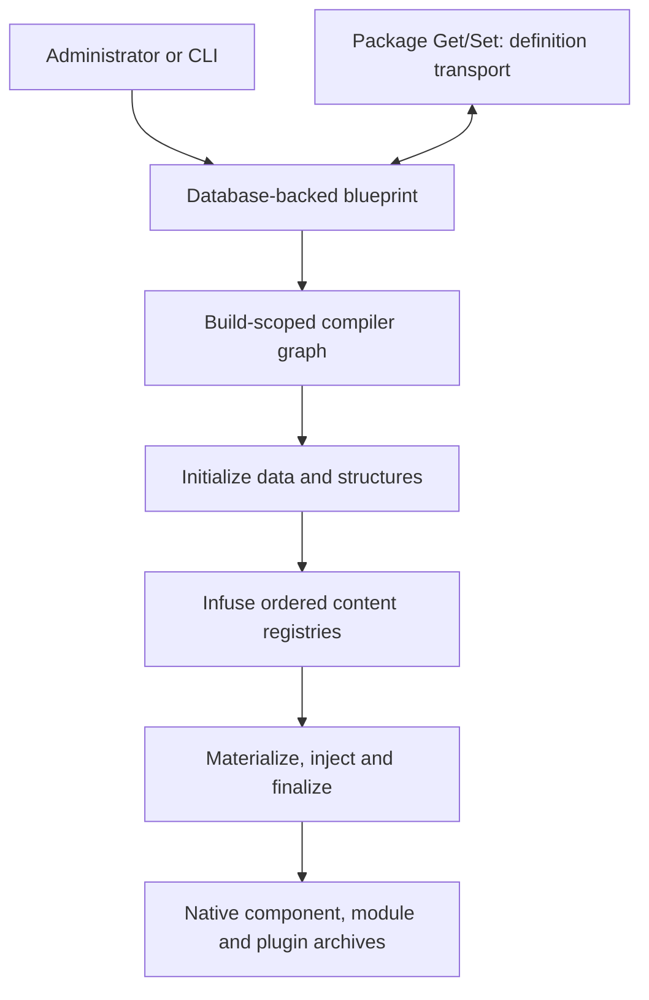

# Project identity

## Authoritative identity statement

Joomla Component Builder (JCB) is a database-backed, target-version-aware
Joomla extension compiler and definition-management system. It turns a
structured component blueprint, including its linked definitions and linked
modules and plugins, into native Joomla source trees and installable extension
archives.

The blueprint can be authored through JCB's Joomla administrator application
or restored and synchronized through a JCB definition package. In both cases,
the compiler consumes the resulting structured definition graph; it does not
treat an arbitrary directory of handwritten PHP as its primary input. The
database loading path in
[`Compiler\Component\Data`](../../libraries/vendor_jcb/VDM.Joomla/src/Componentbuilder/Compiler/Component/Data.php)
starts with the selected `joomla_component` record, joins the component link
records, and then resolves views, fields, configuration, modules, plugins,
files, update data, routing, and other related definitions.

The primary result is target-native Joomla code, not a runtime dependency on
JCB. A generated component, module, or plugin is expected to follow the
selected Joomla major's structures and APIs and to remain an ordinary Joomla
extension after installation.

## One system, two working surfaces

JCB has two different but cooperating working surfaces.

| Surface | Responsibility | Authority boundary |
| --- | --- | --- |
| Administrator application | Provides the installed Joomla MVC, forms, layouts, tables, permissions, and workflows through which people create and maintain definitions and invoke compilation. The manifest exposes components, modules, plugins, views, fields, templates, layouts, Powers, Joomla Powers, repositories, and the compiler itself. | [`componentbuilder.xml`](../../componentbuilder.xml), [`admin/forms`](../../admin/forms), and [`admin/src`](../../admin/src) define the current installed authoring experience. They are not the home of the compiler's domain engine. |
| Compiler and library engine | Loads and normalizes the definition graph, selects target-specific services, prepares structures, composes generated content, resolves reusable code, writes files, processes languages and custom code, and creates archives. | [`libraries/vendor_jcb/VDM.Joomla/src/Componentbuilder/Compiler`](../../libraries/vendor_jcb/VDM.Joomla/src/Componentbuilder/Compiler) and its composition root, [`Compiler\Factory`](../../libraries/vendor_jcb/VDM.Joomla/src/Componentbuilder/Compiler/Factory.php), own compilation behavior. |

The administrator compile model is intentionally thin: it resolves the shared
compiler service and calls `run()` in
[`CompilerModel::compile()`](../../admin/src/Model/CompilerModel.php). The CLI
sets the same component and compiler options, resolves the same service,
collects component/module/plugin output paths, and resets the compiler factory
between builds in
[`Componentbuilder\Console\Compiler`](../../libraries/vendor_jcb/VDM.Joomla/src/Componentbuilder/Console/Compiler.php).
The GUI and CLI are entry points to one compiler identity, not independent
implementations of generation.

## Self-hosting is part of the identity

JCB builds JCB. The repository identifies the installed component as created
and generated with JCB in its [project README](../../README.md), and the
administrator application is generated from JCB's own maintained definition.
This creates a deliberate self-hosting loop:

1. JCB's structured definition is the durable design source for its generated
   Joomla application.
2. The generated administrator tree is real production code and therefore a
   compatibility surface, but it is not an independent source model.
3. A necessary administrator change must be carried back into the maintained
   definition or generation input so that the next compile does not erase it.
4. Changes to compiler/library behavior must continue to support compiling
   JCB itself; a smaller fixture alone cannot prove that contract.

Self-hosting is not a reason to avoid improving the administrator application.
It is a requirement to preserve provenance and close the round trip whenever
that generated surface changes. The repository's
[change-boundary policy](../development/change-boundaries.md) therefore makes
the administrator tree read-only by default and requires an explicit transfer
record for every authorized change.

## Enduring objectives

JCB exists to keep these outcomes true:

1. **Model extension intent structurally.** Components, views, fields,
   relationships, queries, permissions, layouts, languages, custom code,
   modules, plugins, and reusable definitions remain an inspectable graph
   rather than an untracked collection of copied files.
2. **Compile the graph into complete native artifacts.** Structure, source,
   manifests, SQL, language files, assets, install/update behavior, and
   archives must agree with one another.
3. **Separate intent from target mechanics.** A definition expresses what the
   extension is; version-selected services decide how that intent is emitted
   for a supported Joomla target.
4. **Make reuse first-class.** Shared definitions, custom code, templates,
   layouts, libraries, Powers, and Joomla Powers must be referencable without
   duplicating or hardcoding project-specific placement.
5. **Preserve controlled customization.** Placeholder and custom-code
   pipelines must allow a project to specialize generated output without
   turning generation into an untraceable overwrite operation.
6. **Keep source definitions portable.** Definition distribution may move a
   blueprint and its dependency graph between installations and repositories
   without confusing that source transport with compilation.
7. **Scale by orchestration and reuse.** Shared build-scoped services,
   normalized models, focused registries, and cached entity resolution should
   avoid needless repeated work while preserving observable output.

The practical value is leverage with traceability: one relational definition
graph can produce a coherent family of Joomla artifacts, while target-specific
mechanics and reusable code remain centrally maintained. This reduces manual
duplication and version drift without hiding the generated source from its
maintainer.

## Scope and non-goals

JCB's scope is broad inside the Joomla extension domain and deliberately
narrow outside it.

| In scope | Not a project objective |
| --- | --- |
| Authoring and maintaining relational definitions for Joomla components and their linked modules, plugins, views, fields, queries, layouts, assets, languages, permissions, installation behavior, and reusable code. | Acting as a general-purpose PHP transpiler, arbitrary website builder, or framework-independent application runtime. |
| Compiling those definitions into inspectable, installable, target-native Joomla artifacts. | Requiring JCB itself as a runtime service for an installed generated extension. |
| Preserving intentional custom code and placeholder-driven project specialization across rebuilds. | Treating arbitrary edits to generated files as a new, untracked source model. |
| Selecting architecture and Joomla API references for the requested supported target. | Emitting one lowest-common-denominator codebase and delegating avoidable version differences to runtime compatibility layers. |
| Reusing and distributing definitions, Powers, Joomla Powers, templates, layouts, libraries, and their declared dependencies. | Treating definition distribution as compilation or treating an installable extension archive as an editable source blueprint. |
| Improving internal services, tests, entry points, and automation while preserving the compiler's observable contracts. | Reordering stages, events, registries, placeholders, or filesystem effects merely to make the internal class graph look simpler. |
| Achieving efficient builds through shared state, caching, focused passes, and bounded lifecycle management. | Promising one fixed compile duration regardless of definition size, configured integrations, hardware, or environment. |

## Inputs, products, and adjacent outputs

| Category | Current contract |
| --- | --- |
| Primary source input | A selected database-backed `joomla_component` definition and its related admin/site/custom views, fields, configuration, templates/layouts, libraries, custom code, modules, plugins, update/install metadata, and other linked entities. [`Compiler\Component`](../../libraries/vendor_jcb/VDM.Joomla/src/Componentbuilder/Compiler/Component.php) guards loading the complete component once per build. |
| Build input | Compiler options and environment, including target Joomla major, component identity, paths, placeholder settings, build-date policy, minification, Powers, backups, and repository behavior. The supported target catalogue is held by [`Compiler\Config`](../../libraries/vendor_jcb/VDM.Joomla/src/Componentbuilder/Compiler/Config.php). |
| Structural input | Version-family compiler templates, static files, generated-objective services, and extension structure builders. These are combined with normalized definitions; templates alone are not the product model. |
| Reusable input | Custom code, language data, fields, templates, layouts, libraries, Super Powers, and Joomla Powers, including dependencies that may be retrieved through approved Package Get capabilities. |
| Primary build products | A generated Joomla component source tree and archive, plus source trees and archives for linked modules and plugins. [`Compiler::run()`](../../libraries/vendor_jcb/VDM.Joomla/src/Componentbuilder/Compiler.php) owns finalization and packaging order. |
| Supporting build products | Generated Power files and autoloading, manifests, SQL and lifecycle scripts, language files, README/update metadata, file-path records, notices, and configured backup/repository copies. These support the primary extensions; they do not replace them. |
| Definition-distribution products | Serialized definition documents and their dependency files/folders synchronized with configured repositories by Package Get/Set. These are source inputs for future compilation, not Joomla installable extension archives. |

## The execution stack is a contract

The compiler is a staged transformation, and stage order is part of its
meaning. The complete source-ordered reference is the
[compiler execution flow](compiler-execution-flow.md). Resolving the shared
`Compiler` service is already an active
operation: its constructor starts the build timer, calls
[`Initializer::init()`](../../libraries/vendor_jcb/VDM.Joomla/src/Componentbuilder/Compiler/Initializer.php),
and only then invokes the legacy
[`Infusion`](../../libraries/vendor_jcb/VDM.Joomla/src/Componentbuilder/Compiler/Helper/Infusion.php)
constructor. `run()` performs the later file-update and packaging phases. Code
must not assume that `run()` is the first point at which compilation work
occurs.

The current sequence is:

1. **Select the build.** The administrator or CLI supplies the component and
   compiler options, including the compile target.
2. **Compose one build scope.** `Compiler\Factory` creates shared services and
   focused mutable builders for one compilation. Independent builds require a
   fresh scope.
3. **Initialize and normalize.** `Initializer` triggers pre-load events,
   configures language and field building, extracts installed custom code,
   builds the full component model, normalizes version state, resets the build
   directory, loads required utility Powers, and prepares component, library,
   Power, module, and plugin structures.
4. **Compose content in order.** `Infusion::buildFileContent()` acts as the
   conductor. It seeds global content, walks admin, custom-admin, and site
   objectives, switches build/language context at defined points, and writes
   generated fragments into
   [`ContentOne`](../../libraries/vendor_jcb/VDM.Joomla/src/Componentbuilder/Compiler/Builder/ContentOne.php)
   and
   [`ContentMulti`](../../libraries/vendor_jcb/VDM.Joomla/src/Componentbuilder/Compiler/Builder/ContentMulti.php).
   It also replays deferred admin callbacks for work whose required facts
   become available only after the first admin-view pass, performs the explicit
   second configuration-fieldset pass, and then continues with later
   objectives before infusing linked modules and plugins. This is ordered
   deferred work, not a recursive second invocation of the entire compiler.
5. **Materialize files.** The
   [`Extension\Files\Updater`](../../libraries/vendor_jcb/VDM.Joomla/src/Componentbuilder/Compiler/Extension/Files/Updater.php)
   applies static and dynamic content to component, module, plugin, and Power
   files and establishes autoloading.
6. **Finalize and package.** `Compiler::run()` preserves the ordered path and
   cleanup setup, file update, custom-code injection, language generation,
   server XML/README work, local repository synchronization, component
   archive, module archives, plugin archives, notices, and timer completion.

Given the same normalized definitions, compile configuration, templates, and
explicit environment-dependent inputs, the semantic generated tree must be
reproducible. An intentionally selected build date, output root, external
custom code, or repository state is an input and must not be mistaken for
compiler randomness. Refactoring may change class boundaries, but it must not
silently change stage order, event order, builder paths, placeholders,
generated paths, archive names, or failure boundaries.

## Powers are portable code; Joomla Powers are versioned references

The two Power domains solve related but different reuse problems and must stay
separate.

### Powers and Super Powers

A JCB Power is a reusable PHP unit maintained as structured JCB data and
referenced in code by a stable `Super___<GUID>___Power` key. The compiler's
[`Power`](../../libraries/vendor_jcb/VDM.Joomla/src/Componentbuilder/Compiler/Power.php)
loader resolves a Power once per build, follows Power relationships, processes
custom code and placeholders, validates its namespace, and records its class,
namespace, dependencies, and distribution metadata. “Super Power” describes
the portable/repository-facing identity of those Power definitions; it does
not make them Joomla core API aliases.

Placement is contextual rather than hardcoded. Namespace placeholders are
resolved first. The
[`Joomla\Path`](../../libraries/vendor_jcb/VDM.Joomla/src/Componentbuilder/Compiler/Joomla/Path.php)
resolver recognizes component, module, and plugin namespaces and directs a
Power into the matching generated extension area; other Powers use the
configured Powers library path. The
[`Power\Structure`](../../libraries/vendor_jcb/VDM.Joomla/src/Componentbuilder/Compiler/Power/Structure.php)
builder then creates the files and records the paths used by autoloading and
packaging. This allows one maintained class to adopt the namespace and physical
home of the project that consumes it.

### Joomla Powers

A Joomla Power is a target-aware reference to a Joomla API class, represented
by a stable `Joomla___<GUID>___Power` key. The
[`JoomlaPower`](../../libraries/vendor_jcb/VDM.Joomla/src/Componentbuilder/Compiler/JoomlaPower.php)
loader selects the namespace and type declared for the compile target, while
the
[`JoomlaPower\Injector`](../../libraries/vendor_jcb/VDM.Joomla/src/Componentbuilder/Compiler/JoomlaPower/Injector.php)
adds or reuses an appropriate import and resolves name collisions. Joomla
Powers let templates and custom code refer to a stable identity even when the
corresponding Joomla namespace differs by target.

Therefore:

- Power/Super Power definitions remain reusable owned PHP code and retain their
  `Super___<GUID>___Power` identity, Power-to-Power dependency expansion,
  placeholder-aware namespace processing, physical placement, and autoloading;
- Joomla Powers remain references to target-specific Joomla APIs and retain
  their `Joomla___<GUID>___Power` identity, compile-target namespace/type
  selection, import reuse, aliasing, and collision handling; and
- neither pipeline may be replaced by ad hoc imports or copied classes during
  unrelated refactoring.

## Target-version identity

JCB currently recognizes Joomla 3, 4, 5, and 6 as compile targets in
[`Compiler\Config`](../../libraries/vendor_jcb/VDM.Joomla/src/Componentbuilder/Compiler/Config.php).
Joomla 4 through 6 can share a broad template family where their structures
are identical, while distinct version services preserve their independent
identity and future evolution.

Two version axes must remain explicit:

| Axis | Governs |
| --- | --- |
| Host Joomla major | Integration with the Joomla installation currently running JCB, such as events, history, and installed-core introspection. |
| Compile target Joomla major | The architecture, APIs, manifests, headers, module/plugin structures, and Joomla Power namespaces emitted into the generated extension. |

Target-native generation is an enduring objective. New behavior must use a
stable interface/service alias and let the provider select the appropriate
target implementation. It must not scatter host checks through generated-code
consumers, collapse target identities merely because output is currently
equal, or require a compatibility plugin to make an avoidably wrong target
run.

## Package distribution is not compilation

[`Componentbuilder\Package`](../../libraries/vendor_jcb/VDM.Joomla/src/Componentbuilder/Package)
is the definition distribution boundary. Its
[`Get`](../../libraries/vendor_jcb/VDM.Joomla/src/Componentbuilder/Package/Builder/Get.php)
and
[`Set`](../../libraries/vendor_jcb/VDM.Joomla/src/Componentbuilder/Package/Builder/Set.php)
builders retrieve and publish JCB entity documents and recursively process
their entity, file, and folder dependencies.

The distinction is strict:

| Package distribution | Compiler |
| --- | --- |
| Moves or restores the source definition graph. | Transforms a loaded definition graph into generated source and archives. |
| Produces/consumes repository documents and dependency assets. | Produces Joomla component, module, and plugin artifacts. |
| Has Get and Set workflows in its standalone factory. | Reuses only Package Get capabilities when compilation needs a missing approved definition. |
| Preserves source portability. | Preserves generated-output correctness. |

Calling source definitions a “JCB package” must never cause an implementation
to treat them as an installable Joomla package. Conversely, a compiled ZIP is
not the authoritative JCB blueprint from which future structural edits should
be made.

## Quality, compatibility, and performance principles

### Quality

- Generated trees, not isolated method returns, are the product. Tests must
  protect structures, contents, manifests, languages, placeholders, and
  archives together.
- Observable contracts include event names and order, registry paths and
  value shapes, by-reference mutations, messages, filesystem side effects,
  custom-code behavior, and failure boundaries.
- Exact or normalized golden-tree comparisons are the primary proof that a
  mechanical refactor preserved generation. Every intentional semantic diff
  must be explained rather than normalized away.
- Generated code must remain inspectable, maintainable, and native to the
  selected Joomla target.

### Compatibility

- The structured definition and generated-output contracts take precedence
  over internal class arrangement.
- Existing extension definitions, Power keys, Joomla Power keys, placeholders,
  public compatibility seams, and compiler events must continue to mean the
  same thing unless a deliberate migration is specified.
- Host and target version selection must never be conflated.
- The self-hosted JCB definition and the resulting administrator application
  must remain reconcilable.

### Performance

- Reuse normalized data and shared build-scoped services instead of repeating
  database loads, parsing, namespace resolution, or generation work.
- Cache by stable entity identity only when the cache is valid for the entire
  build scope. Discard that scope between independent builds so speed does not
  create state leakage.
- Preserve the ordered bulk passes and focused builders that allow downstream
  consumers to reuse work already completed.
- Evaluate performance on representative small and large definition graphs,
  but do not trade correctness for a fixed elapsed-time claim. The project
  promises architectural efficiency and output fidelity, not one universal
  duration on every host.

## Identity test for every proposed change

A feature, refactor, or integration belongs in JCB only when the answer to all
applicable questions is **yes**:

1. **Source of truth:** Does it preserve a structured, portable definition as
   the authority instead of introducing an untracked handwritten fork?
2. **Native product:** Does it strengthen or preserve generation of complete,
   installable, target-native Joomla component/module/plugin artifacts?
3. **Correct boundary:** Is it placed in the administrator authoring surface,
   compiler engine, Package distribution system, or reusable-code domain that
   actually owns the behavior?
4. **Execution integrity:** Does it preserve initialization, infusion,
   materialization, event, language, repository, and packaging order unless a
   separately specified behavior change intentionally revises that contract?
5. **Reproducibility:** Can the same complete input set produce the same
   semantic output tree, with environmental inputs explicit and controlled?
6. **Version correctness:** Does it use the correct host/target axis and keep
   every supported target behind stable version-selected contracts?
7. **Reuse integrity:** Does it preserve the distinct contracts: Power/Super
   Power dependency expansion and physical placement, and Joomla Power target
   selection, import reuse, and alias handling?
8. **Self-hosting closure:** If it affects JCB's generated administrator
   application, can the change be represented in and regenerated from JCB's
   maintained definition?
9. **State and performance:** Does it reuse work without leaking mutable state
   between builds or bypassing the focused builder/service lifecycle?
10. **Evidence:** Is the claim demonstrated at the appropriate unit,
    provider, characterization, full-tree, Package, or Joomla smoke-test
    level?

A “no” is not a documentation problem. It means the proposal is outside JCB's
identity, is placed at the wrong boundary, or is incomplete and must be
redesigned before implementation.
