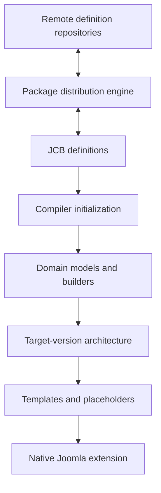

# System map

For the enduring purpose behind these boundaries, start with the
[project identity](project-identity.md). For repository ownership and mutation
permission, the [change-boundary policy](../development/change-boundaries.md)
is authoritative.

## What JCB is

JCB is a compiler-driven extension engineering system. Structured definitions
stored in Joomla are loaded into domain models, normalized into shared build
state, rendered into version-specific source and metadata, written into an
extension structure, and finally packaged. A second subsystem synchronizes JCB
definitions with remote repositories so they can be distributed and restored.



Compilation and definition distribution touch some of the same entities and
repository adapters, but they have different outputs and lifecycles:

| Subsystem | Input | Output | Primary entry point |
| --- | --- | --- | --- |
| Compiler | Database-backed component/module/plugin definitions plus build configuration | Generated Joomla source trees and installable archives | [`Componentbuilder\Compiler\Factory`](../../libraries/vendor_jcb/VDM.Joomla/src/Componentbuilder/Compiler/Factory.php) |
| Package | Entity identifiers and repository configuration | Imported or exported JCB definition documents and related files/folders | [`Componentbuilder\Package\Factory`](../../libraries/vendor_jcb/VDM.Joomla/src/Componentbuilder/Package/Factory.php) |
| Entity routing | Canonical database entity or logical area | Correct entity-specific container factory | [`Componentbuilder\Factory`](../../libraries/vendor_jcb/VDM.Joomla/src/Componentbuilder/Factory.php) |

## Library layers

The code under `libraries/vendor_jcb` is split by responsibility rather than
placed in one monolithic namespace.

This section describes only the JCB-owned `libraries/vendor_jcb/**` tree. The
sibling `libraries/phpseclib3/**` and `libraries/phpspreadsheet/**` trees are
externally maintained dependencies and must not be modified in this
repository.

| Layer | Representative location | Role |
| --- | --- | --- |
| Foundation | [`VDM.Joomla/src/Abstraction`](../../libraries/vendor_jcb/VDM.Joomla/src/Abstraction), [`Interfaces`](../../libraries/vendor_jcb/VDM.Joomla/src/Interfaces), [`Utilities`](../../libraries/vendor_jcb/VDM.Joomla/src/Utilities) | Reusable registries, factories, contracts, helpers, and infrastructure |
| Generic data/infrastructure | [`VDM.Joomla/src/Data`](../../libraries/vendor_jcb/VDM.Joomla/src/Data), [`Database`](../../libraries/vendor_jcb/VDM.Joomla/src/Database), [`File`](../../libraries/vendor_jcb/VDM.Joomla/src/File), [`Model`](../../libraries/vendor_jcb/VDM.Joomla/src/Model) | Domain-neutral persistence and transformation services |
| Componentbuilder domain | [`VDM.Joomla/src/Componentbuilder`](../../libraries/vendor_jcb/VDM.Joomla/src/Componentbuilder) | Compiler, Package, powers, migration, search, import, repositories, and JCB-specific models |
| Remote adapters | [`VDM.Joomla.Git`](../../libraries/vendor_jcb/VDM.Joomla.Git/src), [`VDM.Joomla.Gitea`](../../libraries/vendor_jcb/VDM.Joomla.Gitea/src), [`VDM.Joomla.Github`](../../libraries/vendor_jcb/VDM.Joomla.Github/src) | Common Git concepts and provider-specific APIs |
| AI adapter | [`VDM.Joomla.Openai`](../../libraries/vendor_jcb/VDM.Joomla.Openai/src) | OpenAI API services kept outside the compiler domain |
| Compatibility/support | [`VDM.Joomla.FOF`](../../libraries/vendor_jcb/VDM.Joomla.FOF/src), [`VDM.Minify`](../../libraries/vendor_jcb/VDM.Minify/src), [`VDM.Psr`](../../libraries/vendor_jcb/VDM.Psr/src) | Focused supporting libraries |

Dependencies should point from domain-specific code to general contracts and
infrastructure: compiler services may depend on a generic registry, while the
generic registry must not depend on compiler code. The table order is
descriptive, not an arrow direction.

## Namespace loading

The installed component namespace is declared as
`VDM\Component\Componentbuilder` in `componentbuilder.xml`. The additional
vendor libraries are loaded by
[`PowerloaderHelper.php`](../../admin/src/Helper/PowerloaderHelper.php), which
maps namespace prefixes to the corresponding `libraries/vendor_jcb/*/src`
folders.

More-specific prefixes are intentionally checked before `VDM\Joomla`:

| Namespace prefix | Library folder |
| --- | --- |
| `VDM\Joomla\Github` | `VDM.Joomla.Github` |
| `VDM\Joomla\Openai` | `VDM.Joomla.Openai` |
| `VDM\Joomla\Gitea` | `VDM.Joomla.Gitea` |
| `VDM\Joomla\Git` | `VDM.Joomla.Git` |
| `VDM\Joomla\FOF` | `VDM.Joomla.FOF` |
| `VDM\Joomla` | `VDM.Joomla` |
| `VDM\Minify` | `VDM.Minify` |
| `VDM\Psr` | `VDM.Psr` |

This ordering prevents the broad `VDM\Joomla` prefix from swallowing a sibling
library. New sibling namespaces must preserve that most-specific-first rule.

## Three factory roles

The word “factory” is used for related but distinct responsibilities.

### Container factory

[`VDM\Joomla\Abstraction\Factory`](../../libraries/vendor_jcb/VDM.Joomla/src/Abstraction/Factory.php)
provides static service resolution over one lazily created Joomla DI container.
Compiler, Package, Power, JoomlaPower, Data Migrator, Gitea, Github, and OpenAI
factories specialize this pattern by registering the providers required for
their bounded context.

Services are generally registered with `share(...)`, so repeated resolution
within one factory lifecycle returns the same object. This is especially
important for mutable builder registries.

### Entity-to-factory router

[`Componentbuilder\Factory`](../../libraries/vendor_jcb/VDM.Joomla/src/Componentbuilder/Factory.php)
is not the compiler container. It is the authoritative map from a canonical
database entity to:

- a logical area name;
- the container factory responsible for that entity; and
- whether the entity is a top-level “superpower” for distribution purposes.

It derives reverse maps once, giving constant-time routing. Classes that need
entity-scoped capabilities use
[`FactoryTrait`](../../libraries/vendor_jcb/VDM.Joomla/src/Componentbuilder/FactoryTrait.php)
to resolve and cache the correct factory.

### Joomla Power resolution

Joomla Powers represent version-aware references to Joomla classes used by
generated extensions. They are not interchangeable with Super Powers, which
represent reusable user/domain code. Generated `Joomla___…___Power` references
are part of JCB's resolution contract and must not be silently replaced with a
native import during unrelated refactoring.

## Configuration is a lazy function registry

[`Compiler\Config`](../../libraries/vendor_jcb/VDM.Joomla/src/Componentbuilder/Compiler/Config.php)
extends `ComponentConfig`, which extends
[`FunctionRegistry`](../../libraries/vendor_jcb/VDM.Joomla/src/Abstraction/FunctionRegistry.php).
A read such as `$config->component_code_name` resolves a protected method named
like `getComponentcodename()`, caches the result in the registry, and permits a
later explicit override.

Resolution can draw from:

1. an already cached or explicitly set value;
2. a protected computed getter;
3. component parameters;
4. request input; or
5. Joomla global configuration and database helpers used by a getter.

This means Config is mutable compilation state as well as lazy configuration.
Tests and extracted services must not assume every value is immutable or known
at construction time.

## Folder placement rules

The existing tree repeatedly applies locality of purpose:

| If a class… | Place it… | Example |
| --- | --- | --- |
| is reusable across VDM/JCB domains | in a high-level abstraction, interface, utility, data, or service namespace | `VDM\Joomla\Abstraction\Registry` |
| belongs to the compiler broadly | directly under `Componentbuilder/Compiler` or a broad compiler domain | `Compiler\Initializer`, `Compiler\Placeholder` |
| serves one compiler concern | in the corresponding concern folder | `Compiler\Customcode\Extractor`, `Compiler\Extension\Files\Updater` |
| emits one kind of generated architecture | under `Compiler/Architecture/<objective>` | model, controller, view, dashboard, module, or plugin generators |
| differs by compile target | in `JoomlaThree`, `JoomlaFour`, `JoomlaFive`, or `JoomlaSix` below the closest common domain — but only for the targets that actually differ | `Architecture/JoomlaFive/AdminView/AddToolBar` |
| renders the same for every compile target | in the root of its concern folder, with no `Joomla*` class at all | `Architecture/Layout/View` |
| is state collected for later compilation | in a focused class under `Compiler/Builder` and registered as a shared service | `Builder\PermissionAction` |
| synchronizes one entity with repositories | under `Componentbuilder/Package/<Entity>` with service, Remote Config, resolver, or Readme concerns | `Package/AdminView/Remote/Config` |

Do not choose a destination from the method name alone. Trace its callers,
state reads/writes, generated artifact, version axis, and collaborators. The
closest stable objective shared by that whole cluster determines placement.

### A target class must earn its existence

The `Joomla*` namespaces exist to remove `if ($version == 3)` branches from
rendering code, not to give every target a name. A target only earns a class
where the code it generates actually differs from the other targets. Read the
legacy method first: a `joomla_version` branch inside it names exactly which
targets diverge, and those are the only ones that get a class.

Everything else shares one implementation in the root of the concern folder:

- **All four targets differ** — four classes under `JoomlaThree`,
  `JoomlaFour`, `JoomlaFive`, and `JoomlaSix`, and no root class.
  `Architecture/*/Dashboard/View` is this shape.
- **Some targets differ** — a class for each diverging target, extending a
  shared implementation in the root of the concern folder. The targets that
  share that rendering get no class of their own.
  `Architecture/AdminViews/ListHead` is this shape: only `JoomlaThree`
  guards its sorting differently, so `JoomlaThree/AdminViews/ListHead`
  extends it and Joomla 4, 5, and 6 use the root class directly.
- **No target differs** — one class in the root of the concern folder and no
  `Joomla*` namespace involved at all. `Architecture/Layout/View` is this
  shape.

A class whose body is empty because it only extends a shared implementation is
the anti-pattern this rule removes: it adds a name without adding behaviour.
[`VersionedPermissionRendererTest`](../../libraries/vendor_jcb/tests/VDM.Joomla/src/Componentbuilder/Compiler/Architecture/VersionedPermissionRendererTest.php)
enforces both halves — it lists which targets each family covers, and it fails
on any class under a `Joomla*` namespace that declares no member of its own.

The service provider follows the same shape. A family whose targets all differ
keeps the plain `'…J' . $this->targetVersion . '…'` selector. A collapsed
family names its diverging targets and falls through to a `Shared` key:

```php
public function getAdminViewsListHead(Container $container): AdminViewsListHead
{
    if (empty($this->targetVersion))
    {
        $this->targetVersion = $container->get('Config')->joomla_version;
    }

    // only Joomla 3 guards its sorting differently
    if ((int) $this->targetVersion === 3)
    {
        return $container->get('Architecture.AdminViews.J3.ListHead');
    }

    return $container->get('Architecture.AdminViews.Shared.ListHead');
}
```

The stable alias consumers call never changes, so which targets share a
rendering stays an internal detail of the provider. When a future Joomla
release does diverge, add its class and one branch — do not reintroduce the
empty siblings.

## Data Migrator boundary

[`Componentbuilder\Data\Migrator\Factory`](../../libraries/vendor_jcb/VDM.Joomla/src/Componentbuilder/Data/Migrator/Factory.php)
composes generic table/database/model/data services with Componentbuilder data
services. For example, its GUID migrator configures JCB-specific ID-to-GUID
relationships and delegates the mechanics to the generic migrator. It is a
data-shape evolution subsystem, not a compiler rendering stage and not Package
repository synchronization.

## Sibling adapter composition

The sibling libraries follow the same bounded-container principle:

| Library | Factory composition | Boundary |
| --- | --- | --- |
| `VDM.Joomla.Gitea` | utilities plus JCB, settings, organization, user, repository, package, issue, notification, miscellaneous, and admin providers | broad Gitea API surface |
| `VDM.Joomla.Github` | Github utilities plus the Componentbuilder Power Github provider | narrower Github repository/Power surface |
| `VDM.Joomla.Git` | one provider-neutral repository-contents class | delegates the common contents contract to the selected Gitea or Github adapter |
| `VDM.Joomla.Openai` | utilities plus an API provider | standalone OpenAI HTTP/API clients |

The OpenAI library is currently a sibling adapter; it is not registered in the
compiler or Package composition roots. Future AI orchestration should therefore
enter through a deliberate Componentbuilder application service, not by adding
model calls inside Interpretation/Infusion or by exposing the OpenAI factory
directly to generated-code phases.

## Extension direction

New API, CLI, MCP, or AI capabilities should enter through explicit
application-facing services and structured definitions. They should reuse the
existing factories and domain services instead of reaching into helper methods
or mutating builder internals directly. The compiler remains the controlled,
deterministic boundary that turns definitions into Joomla extensions.
